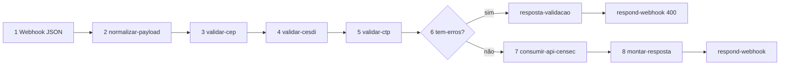

# Agent CENSEC n8n

Agente para **workflows n8n** que expõem a API **CENSEC** (REST JSON) via webhook.
**Não** é SOAP ONR — use [`agent-onr-n8n-soap`](../agent-onr-n8n-soap/SKILL.md) para WSOficio.
**Não** substitui tooling genérico — use [`.agents/skills/n8n-architect/SKILL.md`](../../../.agents/skills/n8n-architect/SKILL.md) para push/pull/validate.

Orquestração ponta a ponta: [`agent-n8n-orchestrator`](../agent-n8n-orchestrator/SKILL.md).

## Escopo

| Inclui | Exclui |
|--------|--------|
| Gateway upload JSON (`CENSEC_UploadJSON`) | DOI (skill futura `agent-doi-n8n`) |
| Validação local CEP, CESDI, CTP | CCN upload XML |
| `POST /api/cargas/upload-json` | RCTO (`testamentos`) — validação manual no gateway atual |
| Coleção `postman/censec-n8n.postman_collection.json` | Chamada direta portal sem n8n |

## Antes de montar o workflow

1. **Vault** (`C:\Users\kenio\Obsidian Vault`):
   - `Orius/integracoes/tabelionato-notas/censec/00-indice-censec.md`
   - `.../censec/visao-geral-e-api.md`
   - `.../censec/automacao/roadmap-censec-n8n.md`
   - Regras: `.../censec/regras-validacao/{cep,cesdi,ctp}.md`
   - Domínios: `.../censec/tabelas-dominio/`
2. **Repo** (`censec/`):
   - `CEP.md`, `CESDI.md`, `CTP.md`, `RCTO.md`
   - `regras-validacao-*.md`, `tabelas-dominio-*.md`
   - `exemplo-censec-json.json`
3. **Workflow canônico:** `workflows/n8n/extensao-n8n-teste/CENSEC Upload JSON Gateway.workflow.ts`
4. **Docs existentes:** vault `.../censec/automacao/utilizacao/CENSEC_UploadJSON.md` e `desenvolvimento/CENSEC_UploadJSON.md`
5. Registry: vault `Meta/integracoes/plane/maps/autonr-work-items.json` → `CENSEC_UploadJSON` (AUTONR-13)

Rodar do context root:

```bash
npx --yes n8nac env status --json
npx --yes n8nac skills validate "workflows/n8n/extensao-n8n-teste/CENSEC Upload JSON Gateway.workflow.ts"
```

## Pipeline obrigatório (gateway CENSEC)

Todo workflow gateway CENSEC segue esta cadeia:



| Etapa | Nó (nome sugerido) | Tipo | Responsabilidade |
|-------|-------------------|------|------------------|
| 1 | `Receive CENSEC Payload` | `webhook` | POST, `responseMode: responseNode`, Basic Auth |
| 2 | `Normalize Payload` | `code` | Extrai body; resolve `ambiente` → `censecBaseUrl` / `censecUploadUrl`; inicia `validation.errors/warnings` |
| 3 | `Validate CEP Acts` | `code` | Regras `atosCep` — ver vault/repo `regras-validacao-cep` |
| 4 | `Validate CESDI Acts` | `code` | Regras `atosCesdi` |
| 5 | `Validate CTP Declarations` | `code` | Regras `declaracoes` |
| 6 | `Has Validation Errors?` | `if` | `validation.hasErrors === true` |
| 6b | `Build Validation Error Response` | `code` | `statusCode: 400`, lista `errors`/`warnings` |
| 7 | `Upload JSON to CENSEC` | `httpRequest` | POST JSON; header `X-Api-Key` do request; `onError: continueRegularOutput` |
| 8 | `Build Upload Response` | `code` | Normaliza sucesso/erro HTTP CENSEC → `statusCode` + `response` |
| 9 | `Return Validation Error` / `Return Upload Response` | `respondToWebhook` | `responseCode` dinâmico |

Detalhes e snippets: [workflow-template.md](workflow-template.md).

### Novos workflows CENSEC

Hoje existe **um** gateway canônico (`CENSEC_UploadJSON`). Ao estender:

- **Mesma operação** → editar workflow existente (pull antes).
- **Nova operação API** → confirmar com usuário se é novo AUTONR ou extensão do gateway; **perguntar** endpoint e escopo de validação.

## Contrato HTTP público (JSON)

### Request

| Campo | Onde | Notas |
|-------|------|-------|
| Body JSON | Payload CENSEC | `atosCep`, `atosCesdi`, `declaracoes`, `testamentos`, quinzena |
| `ambiente` | Body (opcional) | `homologacao` (default) ou `producao` — **removido** antes do upload |
| `X-Api-Key` | Header | Repassado ao `httpRequest` para a API CENSEC |
| Basic Auth | Webhook n8n | `N8N_BASIC_AUTH_USER` / `N8N_BASIC_AUTH_PASSWORD` |

URLs:

| Ambiente | Base |
|----------|------|
| homologacao | `https://hml.censec.org.br` |
| producao | `https://censec.org.br` |

Upload: `{baseUrl}/api/cargas/upload-json`

### Response — envelope CENSEC (não usar envelope ONR)

**Validação local (400):**

```json
{
  "success": false,
  "message": "Payload rejeitado pela validacao local antes do envio para a CENSEC.",
  "errors": [{ "central": "CEP", "path": "...", "code": "...", "message": "..." }],
  "warnings": [],
  "meta": { "ambiente": "homologacao", "censecBaseUrl": "..." }
}
```

**Sucesso (200):**

```json
{
  "success": true,
  "message": "Carga JSON enviada para a CENSEC.",
  "ambiente": "homologacao",
  "censecBaseUrl": "https://hml.censec.org.br",
  "censec": {}
}
```

**Erro upstream CENSEC:** `success: false`, `error`, `technical`; HTTP status espelhado (`statusCode` no nó respond).

> CENSEC **não** usa `status_http` / `sucesso` pt-BR do padrão ONR SOAP.

### Mapeamento HTTP

| Situação | HTTP |
|----------|------|
| Validação local falhou | **400** |
| Upload OK | **200** |
| Erro HTTP CENSEC / rede | **status da API** ou **502** |

## Validação local

Implementar em nós Code encadeados (padrão canônico):

- Estrutura `validation: { errors: [], warnings: [], hasErrors: false }` no item
- Cada validador adiciona em `errors` com `{ central, path, code, message }`
- Ao final de cada nó: `item.validation.hasErrors = errors.length > 0`
- **Não** chamar API se `hasErrors === true`
- RCTO (`testamentos`): gateway atual **não** valida — documentar se incluir validação futura

Fontes de regra (espelhar, não inventar):

- Repo: `censec/regras-validacao-{cep,cesdi,ctp}.md`
- Vault: `Orius/integracoes/tabelionato-notas/censec/regras-validacao/`

## Nomenclatura e arquivos

| Item | Convenção |
|------|-----------|
| Nome workflow | `[AUTONR-n] (CENSEC) <Operacao> - CENSEC` |
| Exemplo | `[AUTONR-13] (CENSEC) CENSEC_UploadJSON - CENSEC` |
| Webhook path | `censec/cargas/upload-json` (upload JSON) |
| Arquivo | Dentro de `workflowsPath` do env ativo |
| Nós | Nomes descritivos em inglês ou kebab-case (seguir canônico) |

## n8n-as-code (obrigatório)

1. `npx --yes n8nac skills validate "<path>.workflow.ts"`
2. `npx --yes n8nac push "<path>.workflow.ts" --verify`
3. `npx --yes n8nac workflow present <workflowId> --json`

## Postman

Coleção: `postman/censec-n8n.postman_collection.json`

| Regra | Valor |
|-------|--------|
| Nome request | `[AUTONR-13] Upload JSON — …` |
| Auth coleção | Basic Auth n8n |
| Header | `X-Api-Key: {{CENSEC_API_KEY}}` |
| Body | JSON com `ambiente` + blocos CEP/CESDI/CTP |
| Testes | `success` presente; validação local não deve falhar em payload completo |

Sync:

```bash
npm run postman:validate:naming -- postman/censec-n8n.postman_collection.json
npm run postman:sync:censec
```

Variáveis: `n8n_base_url`, `censec_n8n_webhook_path`, `CENSEC_API_KEY` — ver `postman/README.md`.

## Checklist de entrega

- [ ] Workflow com pipeline gateway (webhook → validate → API → respond)
- [ ] `n8nac skills validate` OK
- [ ] Request Postman `[AUTONR-n]` alinhado ao body
- [ ] Docs vault `utilizacao/` + `desenvolvimento/`
- [ ] `npm run postman:sync:censec` (+ `n8n:sync:orius` se orquestrador etapa 6)

## Referências

- Template nós: [workflow-template.md](workflow-template.md)
- Exemplo payload: `censec/exemplo-censec-json.json`
- Orquestrador: [agent-n8n-orchestrator](../agent-n8n-orchestrator/SKILL.md)
- n8n tooling: [n8n-architect](../../../.agents/skills/n8n-architect/SKILL.md)
