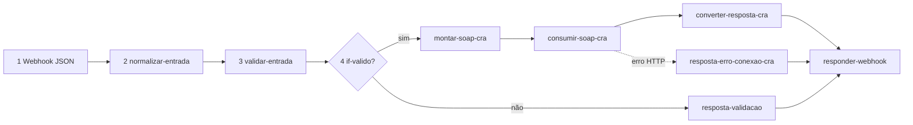

# Agent CRA n8n SOAP

> **DEPRECADO** — use [`.cursor/skills/orius-n8n-integracoes/SKILL.md`](../orius-n8n-integracoes/SKILL.md) com perfil **`soap-cra`**. Este arquivo permanece só como referência histórica.

Agente para **workflows n8n** que expõem as **16 operações SOAP** do CRA21 (`protestos.php`) via webhook JSON.

**Não** é ONR WSOficio — use [`agent-onr-n8n-soap`](../agent-onr-n8n-soap/SKILL.md) apenas para WSOficio.

**Não** cria scripts Python/JS de teste (referência: `scripts/cra/test-cra-soap-once.py`). **Não** substitui tooling n8n — use [`.agents/skills/n8n-architect/SKILL.md`](../../.agents/skills/n8n-architect/SKILL.md).

Orquestração ponta a ponta (8 etapas): [`agent-n8n-orchestrator`](../agent-n8n-orchestrator/SKILL.md).

## Escopo

| Inclui | Exclui |
|--------|--------|
| Workflows proxy CRA em `workflows/n8n/**/*.workflow.ts` | ONR WSOficio, RIB, CCN, API REST CRA |
| AUTOCRA-1…16 (`cra`) | `ConsultarBoletoCancelamento` (WSDL extra, sem card) |
| Coleção `postman/cra-webservice-n8n.postman_collection.json` | Edição manual de `n8nac-config.json` |

## Contexto e paths

| Item | Caminho |
|------|---------|
| Context root | `c:\Users\kenio\automacoes e testes` |
| Vault | `C:\Users\kenio\Obsidian Vault` |
| Métodos (vault) | `Orius/integracoes/tabelionato-protesto/cra/webservice-soap/metodos/` |
| Runbooks | `.../automacao/utilizacao/{Operacao}.md` |
| Layouts XML | `.../layouts-xml/` |
| Respostas / códigos | `.../respostas-e-mensagens/` |
| Repo fonte | `webservice-cra/*.md`, `scripts/cra/soap-requests/*.xml` |
| WSDL local | `wsdl/cra-webservice.wsdl` |
| **Plane** | slug `autocra` · identificador `AUTOCRA` — vault `Meta/integracoes/plane/projetos/autocra.md` |
| Registry Plane | vault `Meta/integracoes/plane/maps/autocra-work-items.json` |
| Credenciais | vault `env.md` → **CRA21 — Webservice SOAP Protesto** (`CRA_USER`, `CRA_PASS`, `CRA_UF`) |

## Antes de montar o workflow

1. Ler método no vault: `metodos/<Operacao>.md` (ou `ConsultaSlip.md`, `AutorizaCancelamento.md`, etc.).
2. Conferir índice: `metodos/00-indice-metodos.md` — direção (upload / download / consulta).
3. Layout XML (upload): `layouts-xml/` correspondente.
4. XML SOAP de referência: `scripts/cra/soap-requests/<SoapOp>.xml`.
5. Regras técnicas: vault `regras-tecnicas.md` (ISO-8859-1, Basic Auth, entidades XML).
6. Resposta: `respostas-e-mensagens/estrutura-relatorio.md` + `codigos-mensagem.md`.
7. Registry: `operacao`, `plane_key`, título 1:1 do card.
8. Roadmap: `automacao/roadmap-cra-webservice-n8n.md`.

Comandos (context root):

```bash
npx --yes n8nac env status --json
npx --yes n8nac skills validate "workflows/n8n/extensao-n8n-teste/<arquivo>.workflow.ts"
```

## Operações (AUTOCRA-1…16)

> Padrão de título: `[AUTOCRA-n] (cra) <SoapOp> - <Domínio>` — skill `@padronizacao-nomenclatura-automacao`.

| AUTOCRA | `operacao` | SOAP | Direção | Parâmetros webhook (snake_case) |
|---------|------------|------|---------|--------------------------------|
| 1 | Remessa | `Remessa` | upload | `user_arq`, `user_dados` |
| 2 | Confirmacao | `Confirmacao` | download | `user_arq` |
| 3 | Retorno | `Retorno` | download | `user_arq` |
| 4 | Desistencia | `Desistencia` | upload | `user_arq`, `user_dados` |
| 5 | Cancelamento | `Cancelamento` | upload | `user_arq`, `user_dados` |
| 6 | Autoriza_Cancelamento | `Autoriza_Cancelamento` | upload | `user_arq`, `user_dados` |
| 7 | Autoriza_Desistencia | `Autoriza_Desistencia` | upload | `user_arq`, `user_dados` |
| 8 | Homologadas | `Homologadas` | download | `codapres`, `cartorios` |
| 9 | Consulta | `Consulta` | consulta | `nosso_numero`, `numero_titulo` |
| 10 | Consulta_Slip | `Consulta_Slip` | consulta | `cod_municipio`, `cod_cartorio`, `protocolo`, `data_protocolo` |
| 11 | Instrumento | `Instrumento` | download | `user_dados` |
| 12 | Imagem | `Imagem` | upload | `user_arq`, `user_dados` |
| 13 | BoletoAutorizacao | `BoletoAutorizacao` | download | `numero_titulo`, `documento_devedor` |
| 14 | Andamento | `Andamento` | download | `user_arq` |
| 15 | Oficio_Titulo | `Oficio_Titulo` | upload | `user_arq`, `user_dados` |
| 16 | ConsultaJustificativa | `ConsultaJustificativa` | consulta | _(nenhum)_ |

**Card âncora (primeiro do lote):** AUTOCRA-16 ou AUTOCRA-9 — define o pipeline reutilizável.

## Pipeline obrigatório (6 etapas)



| Etapa | Nó (nome) | Tipo | Responsabilidade |
|-------|-----------|------|------------------|
| 1 | `Webhook` | `webhook` | POST, path `cra/<slug>`, Basic Auth n8n, `responseMode: responseNode` |
| 2 | `normalizar-entrada` | `set` | Body snake_case → campos internos + defaults de ambiente |
| 3 | `validar-entrada` | `code` | Obrigatórios por operação; `entrada_valida`, `codigo_erro`, `mensagem_erro` |
| 3b | `if-entrada-valida` | `if` | Válido → SOAP; inválido → resposta local |
| 4a | `montar-soap-cra` | `code` | Monta envelope RPC + CDATA quando necessário |
| 4b | `consumir-soap-cra` | `httpRequest` | POST SOAP, Basic Auth **CRA**, headers SOAPAction + ISO-8859-1 |
| 5 | `converter-resposta-cra` | `code` | XML string → JSON snake_case + `status_http` |
| 5b | `resposta-validacao` | `code` | Erros locais (mesmo envelope) |
| 5c | `resposta-erro-conexao-cra` | `code` | Timeout/rede → 502 |
| 6 | `Respond to Webhook` | `respondToWebhook` | `responseCode: ={{ $json.status_http }}` |

Detalhes e snippets: [workflow-template.md](workflow-template.md).

## Contrato HTTP público (JSON)

### Request — snake_case pt-BR

Campos comuns (opcionais no body — fallback `$env` no n8n):

| Campo JSON | Origem | Uso |
|------------|--------|-----|
| `ambiente` | body ou `$env.CRA_AMBIENTE` | `homologacao` \| `producao` |
| `uf` | body ou `$env.CRA_UF` | Sigla estado (`go`, `df`, …) |
| `usuario_cra` | body ou `$env.CRA_USER` | Basic Auth upstream (preferir env no n8n) |
| `senha_cra` | body ou `$env.CRA_PASS` | Basic Auth upstream (preferir env no n8n) |

**Regra:** não expor `senha_cra` na documentação vault; referenciar `[[env#CRA21…]]`.

Parâmetros específicos: ver tabela de operações acima. Upload: `user_dados` aceita XML string ou objeto serializado (documentar no `desenvolvimento/`).

### Response — envelope padrão

```json
{
  "status_http": 200,
  "sucesso": true,
  "codigo": "0000",
  "mensagem": "REGISTROS OK",
  "operacao": "Remessa",
  "dados": {}
}
```

| Campo | Origem XML CRA | Notas |
|-------|----------------|-------|
| `sucesso` | `codigo` em `<relatorio>` / lógica da operação | `0000`, `0002`, `0003` = sucesso conforme operação |
| `codigo` | `codigo` ou código raiz | string preservando zeros à esquerda |
| `mensagem` | `ocorrencia` / texto CRA | |
| `dados` | corpo parseado (`comarcas[]`, `consulta`, `justificativas[]`, xml bruto) | Específico por operação |
| `xml_bruto` | opcional | Útil em debug; omitir em produção se pesado |

### Mapeamento `status_http`

```javascript
function mapearStatusHttpCra(codigo, origem = 'cra') {
  if (origem === 'validacao') return 400;
  const c = String(codigo ?? '').trim();
  if (c === '0001') return 401; // falha autenticação CRA
  if (['0000', '0002', '0003'].includes(c)) return 200;
  if (!c) return 502;
  return 422; // erro de negócio CRA (10000, 2118, 2233, …)
}
```

**Homologação:** códigos como `10000` (arquivo inexistente) ou `2118` (apresentante inválido) com HTTP 200 do SOAP → `status_http: 422`, `sucesso: false` — **não** é falha do workflow.

## SOAP (nós `montar-soap-cra` + `consumir-soap-cra`)

### URL

| Ambiente | Padrão |
|----------|--------|
| Homologação | `https://cra{uf}.cra21.com.br/cra{uf}/xml/protestos.php` |
| Produção | `https://cra{uf}.crabr.com.br/cra{uf}/xml/protestos.php` |

### Envelope (RPC encoded)

Espelhar `scripts/cra/soap-requests/<SoapOp>.xml`:

```xml
<?xml version="1.0" encoding="UTF-8"?>
<soapenv:Envelope
  xmlns:soapenv="http://schemas.xmlsoap.org/soap/envelope/"
  xmlns:xsi="http://www.w3.org/2001/XMLSchema-instance"
  xmlns:xsd="http://www.w3.org/2001/XMLSchema"
  xmlns:urn="urn:crago.cra21.com.br">
  <soapenv:Header/>
  <soapenv:Body>
    <urn:Consulta soapenv:encodingStyle="http://schemas.xmlsoap.org/soap/encoding/">
      <nossoNumero xsi:type="xsd:string">{{ valor }}</nossoNumero>
      <numeroTitulo xsi:type="xsd:string">{{ valor }}</numeroTitulo>
    </urn:Consulta>
  </soapenv:Body>
</soapenv:Envelope>
```

| Item | Regra |
|------|-------|
| Namespace `urn:` | `urn:cra{uf}.cra21.com.br` (HML) ou `urn:cra{uf}.crabr.com.br` (prod) |
| SOAPAction | `{namespace}#{SoapOp}` ex.: `urn:crago.cra21.com.br#Consulta` |
| Content-Type | `text/xml; charset=ISO-8859-1` |
| Auth HTTP | Basic — usuário/senha CRA (nó httpRequest ou credencial n8n) |
| `userDados` | CDATA com XML interno; escapar entidades se sem CDATA |
| ConsultaJustificativa | Elemento vazio, sem parâmetros |

### Autenticação CRA

- **Não** há workflow Auth separado (diferente da ONR).
- Credenciais em **cada** `httpRequest` para o endpoint CRA.
- Preferir variáveis de ambiente no n8n: `CRA_USER`, `CRA_PASS`, `CRA_UF`, `CRA_AMBIENTE`.
- Webhook n8n continua com Basic Auth próprio (`N8N_BASIC_AUTH_*`).

## Validação (nó `validar-entrada`)

Por direção:

| Direção | Regras mínimas |
|---------|----------------|
| upload | `user_arq` formato Febraban; `user_dados` não vazio |
| download (`user_arq`) | `user_arq` não vazio |
| Homologadas | `codapres` obrigatório; `cartorios` opcional (`0` ou `1`) |
| Consulta | pelo menos um de `nosso_numero` / `numero_titulo` ou ambos conforme método |
| Consulta_Slip | os quatro campos; `data_protocolo` `DD/MM/AAAA` |
| Instrumento | `user_dados` XML válido |
| BoletoAutorizacao | `numero_titulo` + `documento_devedor` |
| ConsultaJustificativa | sem campos |

Saída: `entrada_valida`, `codigo_erro` (local, ex. `10`), `mensagem_erro`.

## Nomenclatura

| Item | Convenção |
|------|-----------|
| Nome publicado `@workflow({ name })` | `[AUTOCRA-n] (cra) <SoapOp> - <Domínio>` |
| Arquivo | `workflows/n8n/extensao-n8n-teste/<Nome legível>.workflow.ts` |
| Webhook path | `cra/<slug>` — ex. `cra/consulta`, `cra/remessa`, `cra/consulta-justificativa` |
| Nós | kebab-case pt (`montar-soap-cra`, `consumir-soap-cra`) |
| Postman request | `[AUTOCRA-n] <label>` na pasta **n8n — proxy CRA** |
| Plane | Criar/atualizar cards em `autocra`; estados em `projetos/autocra.md` |

## n8n-as-code (obrigatório)

```bash
npx --yes n8nac skills validate "<path>.workflow.ts"
npx --yes n8nac push "<path>.workflow.ts" --verify
npx --yes n8nac workflow present <workflowId> --json
```

## Postman

Coleção: `postman/cra-webservice-n8n.postman_collection.json`

```bash
npm run postman:build:cra
npm run postman:validate:naming -- postman/cra-webservice-n8n.postman_collection.json
```

- Basic Auth: `N8N_BASIC_AUTH_USER` / `N8N_BASIC_AUTH_PASSWORD`
- Body JSON alinhado ao webhook
- Teste: `pm.response.code === json.status_http`
- Atualizar `cra_webhook_path_<slug>` e `n8n_workflow_id_<slug>` na coleção após push

## Documentação vault (par com workflow)

| Arquivo | Pasta |
|---------|-------|
| `utilizacao/{Operacao}.md` | `.../automacao/utilizacao/` (já existe — atualizar com webhook) |
| `desenvolvimento/{Operacao}.md` | `.../automacao/desenvolvimento/` (criar via template orquestrador) |

Sync Plane: `npm run plane:sync:utilizacao` (após docs).

## Métodos especiais

| Caso | Ação |
|------|------|
| **Upload com XML grande** | `user_dados` pode exceder limite do body JSON — avaliar multipart ou referência a arquivo |
| **Imagem / base64** | Layout `remessas`; limite 200 MB — timeout 30 min |
| **Resposta multi-comarca** | Parsear vários `<comarca codmun="...">` → `dados.comarcas[]` |
| **Consulta título vazio** | `<consulta>` mínimo = sucesso técnico, `sucesso: false` no negócio |
| **Namespace por UF** | Montar dinamicamente a partir de `uf` + `ambiente` — nunca hardcodar só `crago` |

## Checklist de entrega

- [ ] Workflow `.workflow.ts` com pipeline completo + ramos de erro
- [ ] `n8nac skills validate` OK
- [ ] `n8nac push --verify` + ID gravado no Postman/registry
- [ ] `desenvolvimento/{Operacao}.md` com mapeamento JSON ↔ SOAP
- [ ] `utilizacao/{Operacao}.md` atualizado (webhook, não só curl)
- [ ] Request Postman na pasta n8n — proxy CRA
- [ ] Payload JSON de teste documentado

## Referências

- Template nós: [workflow-template.md](workflow-template.md)
- Teste script: `scripts/cra/test-cra-soap-once.py`
- Padronização: vault `Orius/desenvolvimento/padronizacao-n8n-autonr-plane-postman.md`
- n8n tooling: [`.agents/skills/n8n-architect/SKILL.md`](../../.agents/skills/n8n-architect/SKILL.md)
