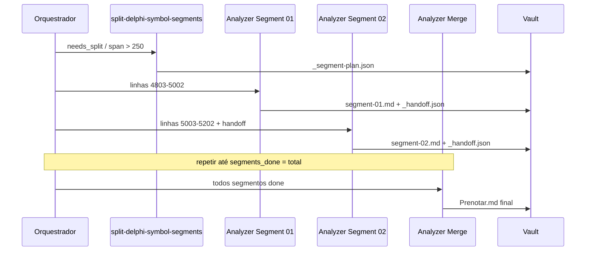

# Schema — segmentação de símbolos grandes

## Limites (obrigatórios)

| Constante | Valor | Uso |
|-----------|-------|-----|
| `SPLIT_THRESHOLD` | **250** | Acima disso → pipeline de segmentos |
| `CHUNK_SIZE` | **200** | Máximo de linhas por segmento |
| `CHUNK_HARD_MAX` | **220** | Orquestrador rejeita segmento maior |

Script: `npm run delphi:split-segments -- --symbol Prenotar --product-slug imoveis --sync-vault --update-batch`

---

## Symbol card — campos de segmentação

Além dos campos padrão do símbolo:

| Campo | Tipo | Descrição |
|-------|------|-----------|
| `needs_split` | boolean | `true` se span > 250 |
| `split_threshold` | number | 250 |
| `chunk_size` | number | 200 |
| `segment_status` | string | `pending` \| `in_progress` \| `done` |
| `segments_total` | number | |
| `segments_done` | number | |
| `segment_plan_vault` | string | path `_segment-plan.json` |
| `merge_status` | string | `pending` \| `in_progress` \| `done` |
| `segments` | object | mapa `segment-NN` → estado |

### `segments[segment-NN]`

| Campo | Descrição |
|-------|-----------|
| `id` | `01`, `02`, … |
| `line_start`, `line_end` | |
| `status` | `pending` \| `in_progress` \| `done` |
| `vault_path` | `.../segment-01.md` |

---

## Vault — pasta do símbolo fatiado

```
unidades/dmPedido/Prenotar/
  _segment-plan.json      # plano (script)
  _segmentos.md           # índice humano
  _handoff.json           # estado cumulativo entre segmentos
  segment-01.md … segment-NN.md
unidades/dmPedido/Prenotar.md   # nota final (merge)
```

### `_handoff.json` (schema)

```json
{
  "symbol": "Prenotar",
  "unit": "dmPedido",
  "last_segment_id": "03",
  "last_line": 5402,
  "flow_summary": "",
  "variables_in_scope": [],
  "datasets_touched": [],
  "sql_tables": [],
  "calls_made": [],
  "open_branches": [],
  "errors_messages": [],
  "business_rules": []
}
```

---

## Fluxo orquestrador



**Segmentos do mesmo símbolo: sempre sequenciais.** Símbolos diferentes: paralelo OK.

---

## Gates símbolo fatiado

| Fase | Gate |
|------|------|
| Segmento | handoff_updated + nota segment-NN |
| Merge | cobertura + sql + fluxo + briefing |
| Símbolo done | merge_status done + gates finais |

Ver skills: `agent-delphi-analyzer-segment`, `agent-delphi-analyzer-merge`.
