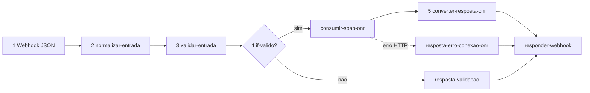

# Agent ONR n8n SOAP

> **DEPRECADO** — use [`.cursor/skills/orius-n8n-integracoes/SKILL.md`](../orius-n8n-integracoes/SKILL.md) com perfil **`soap-onr`**. Este arquivo permanece só como referência histórica.

Agente para **workflows n8n** que expõem métodos do **WSOficio (ONR)** via webhook JSON.

## Escopo

| Inclui | Exclui |
|--------|--------|
| Workflows proxy **WSOficio ONR** em `workflows/n8n/**/*.workflow.ts` | RIB, CNIB, CRA, CENSEC, CCN, DOI (projetos Plane próprios) |
| Métodos listados em [`webservice/list-metodos.md`](../../webservice/list-metodos.md) | Scripts CLI em `scripts/` (referência apenas) |
| Coleção Postman `postman/onr-webservice-n8n.postman_collection.json` | Edição manual de `n8nac-config.json` |

## Plane

| Item | Valor |
|------|-------|
| Projeto | `autonr` (`AUTONR`) — **somente WSOficio SOAP** |
| Nota vault | `Meta/integracoes/plane/projetos/autonr.md` |
| Novos cards | `[AUTONR-n] (webservice ONR) <OperacaoSOAP> - <Domínio>` |
| Registry | `Meta/integracoes/plane/maps/autonr-work-items.json` |

> Cards de RIB, CRA, CNIB, CENSEC, etc. **não** pertencem mais a este projeto — ver `Meta/integracoes/plane/palavras-chave-plane.md`.

## Antes de montar o workflow

1. Ler [`webservice/metodos/<Operacao>.md`](../../webservice/metodos/) — entrada/saída WSDL, pré-requisitos, códigos de erro.
2. Conferir módulo e endpoint em [`webservice/list-metodos.md`](../../webservice/list-metodos.md) e capítulo em [`especificacao_wsoficio_dev.md`](../../especificacao_wsoficio_dev.md).
3. Domínios: [`webservice/tabelas-dominio/`](../../webservice/tabelas-dominio/) — linkar, não duplicar enums.
4. Hash (exceto login): [`webservice/hash.md`](../../webservice/hash.md).
5. WSDL local `wsdl/` — **ordem exata** dos campos em `<Operacao>_WSReq`.
6. Script de referência em `scripts/<Operacao>/` e `package.json` (`npm run …`) — espelhar parâmetros e regras de negócio.
7. Workflow canônico: [`workflows/n8n/gentle-juniper-bb6f8f0940a3/Auth ONR.workflow.ts`](../../workflows/n8n/gentle-juniper-bb6f8f0940a3/Auth%20ONR.workflow.ts).
8. Doc do webhook (se existir): `scripts/login/Auth WebService ONR.md` ou criar `scripts/<modulo>/<Operacao> WebService ONR.md`.

Rodar do context root (ver [`AGENTS.md`](../../AGENTS.md)):

```bash
npx --yes n8nac workspace migrate --json
npx --yes n8nac env status --json
npx --yes n8nac skills validate "workflows/n8n/.../Meu Workflow.workflow.ts"
```

## Pipeline obrigatório (5 etapas)

Todo workflow ONR proxy segue esta cadeia:



| Etapa | Nó (nome sugerido) | Tipo | Responsabilidade |
|-------|-------------------|------|------------------|
| 1 | `Webhook` | `webhook` | POST, `responseMode: responseNode`, Basic Auth |
| 2 | `normalizar-entrada` | `set` | Body snake_case pt-BR → campos internos |
| 3 | `validar-entrada` | `code` | Regras de negócio + domínios; seta `entrada_valida`, `codigo_erro`, `mensagem_erro` |
| 3b | `if-entrada-valida` | `if` | Ramo válido → SOAP; inválido → resposta sem chamar ONR |
| 4 | `consumir-soap-onr` | `httpRequest` | XML SOAP; `onError: continueErrorOutput` |
| 4b | `resposta-erro-conexao-onr` | `code` | Falha rede/timeout → `status_http: 502` |
| 5 | `converter-resposta-onr` | `code` | XML → JSON snake_case + `status_http` |
| 5b | `resposta-validacao` | `code` | Erros locais (mesmo envelope JSON) |
| 6 | `Respond to Webhook` | `respondToWebhook` | `responseCode: ={{ $json.status_http }}` |

Detalhes e snippets: [workflow-template.md](workflow-template.md).

## Contrato HTTP público (JSON)

### Request — snake_case pt-BR

- Nomes **intuitivos em português**, não PascalCase da ONR.
- URL do serviço no body: `url_servico_onr` (ex.: `https://hml3-wsoficio.onr.org.br/penhoraonline.asmx`).
- Login: campos de certificado como em Auth ONR (`assunto_certificado`, `cpf`, …).
- Demais métodos: incluir `hash` no body **ou** documentar que o cliente envia `token` + workflow calcula hash (preferir receber `hash` já calculado para não expor `ONR_SERVENTIA_CHAVE` no n8n).

Mapear explicitamente no nó `normalizar-entrada` e na documentação `.md` do webhook (coluna “Campo JSON” → “Campo SOAP”).

### Response — envelope padrão

Sempre incluir `status_http` (espelha o HTTP status line):

```json
{
  "status_http": 200,
  "sucesso": true,
  "codigo_erro": 0,
  "mensagem_erro": "",
  "dados": {}
}
```

| Campo | Origem SOAP | Notas |
|-------|-------------|-------|
| `sucesso` | `RETORNO` | `true`/`false` |
| `codigo_erro` | `CODIGOERRO` | int |
| `mensagem_erro` | `ERRODESCRICAO` | string |
| `dados` | demais campos / arrays | Payload específico do método |

**Login** (`LoginUsuarioCertificado`): manter campos planos no topo (`id_usuario`, `id_instituicao`, `usuario_ativo`, `tokens[]`) por compatibilidade com Auth ONR existente — não obrigar wrapper `dados` só no login.

### Mapeamento `status_http`

Reutilizar a função do Auth ONR:

| Situação | HTTP |
|----------|------|
| `sucesso: true` | **200** |
| Validação local / request inválido (cód. 2, 10–17) | **400** |
| Usuário não encontrado (51) | **404** |
| Usuário/instituição inativos (52, 53) | **403** |
| Erro de negócio ONR (demais) | **422** |
| Erro sistema ONR (0) / XML inválido | **502** |
| Falha gerar tokens (1) | **503** |
| Falha conexão `httpRequest` | **502** |

Copiar `mapearStatusHttp` e helpers de `converter-resposta-onr` / `Auth ONR.workflow.ts`; adaptar `resposta-validacao` para erros específicos do método.

## SOAP (nó `consumir-soap-onr`)

- Namespace: `http://tempuri.org/WSOficio`
- Envelope: `<?xml version="1.0" encoding="utf-8"?>` + `soap:Envelope` + `soap:Body`
- Operação: `<tns:<Operacao>>` com `<tns:oRequest>` (ou estrutura do WSDL)
- Campos XML: **PascalCase WSDL** via expressões `{{ $json.campo_interno }}`
- `LoginUsuarioCertificado`: **sem** `Hash`
- Demais operações: incluir `<tns:Hash>{{ $json.hash }}</tns:Hash>` na posição do WSDL
- Ordem dos elementos = ordem em `webservice/metodos/<Operacao>.md` seção “Ordem do envelope”

## Validação (nó `validar-entrada`)

Implementar em JavaScript (nó Code):

- Campos obrigatórios do método (tabela de entrada do `.md`).
- Regras de [`tabelas-dominio/`](../../webservice/tabelas-dominio/) (ex.: `IDTipoPedido`, `IDStatus`).
- Regras espelhadas dos scripts em `scripts/` (pré-requisitos documentados).
- Normalizações (CPF só dígitos, datas, ints).
- Saída: `entrada_valida: boolean`, `codigo_erro`, `mensagem_erro` (usar códigos ONR quando aplicável).

Não chamar a ONR se `entrada_valida === false`.

## Nomenclatura e arquivos

| Item | Convenção |
|------|-----------|
| Nome workflow / card | `[AUTONR-n] (webservice ONR) <OperacaoSOAP> - <Domínio>` — projeto Plane `autonr` |
| Arquivo workflow | Dentro de `workflowDir` (ver `n8nac env status --json`), ex.: `workflows/n8n/gentle-juniper-bb6f8f0940a3/<Nome>.workflow.ts` |
| Nós | kebab-case pt-BR (`validar-entrada`, `consumir-soap-onr`) |
| Propriedades classe | PascalCase (`ValidarEntrada`, `ConsumirSoapOnr`) |
| Postman request | `[AUTONR-n] …` em `onr-webservice-n8n.postman_collection.json` |
| `<workflow-map>` | Atualizar índice e routing após cada alteração |

## n8n-as-code (obrigatório)

1. `npx --yes n8nac skills validate "<path>.workflow.ts"`
2. `npx --yes n8nac push "<path>.workflow.ts" --verify`
3. Conflito: `npx --yes n8nac resolve <workflowId> --mode keep-current` (local) ou `keep-incoming` (remoto) — **perguntar** se ambos mudaram.

Nunca editar `n8nac-config.json` à mão.

## Postman (opcional)

Ao expor webhook, criar/atualizar `postman/<Operacao>-n8n.postman_collection.json`:

- Basic Auth: `N8N_BASIC_AUTH_USER` / `N8N_BASIC_AUTH_PASSWORD`
- Body snake_case alinhado ao workflow
- Testes: `pm.response.code` === `json.status_http`
- Pré-request: `getVar()` em environment **e** collection (ver `postman/onr-webservice-n8n.postman_collection.json`; sync: `npm run postman:sync`)

## Métodos especiais

| Caso | Ação |
|------|------|
| **3.1 Login** | Referência: Auth ONR; sem `Hash`; pode validar CPF |
| **3.4 BD Light** | Serviço desativado 31/07/2023 — não criar proxy ativo; documentar 404 |
| **Upload / anexos** | Ver script e método; pode exigir base64 ou URL — não simplificar |
| **Arrays aninhados** | Montar XML com loops no Code antes do `httpRequest`, ou template fiel ao script JS |

## Checklist de entrega

- [ ] Workflow `.workflow.ts` com 5 etapas + ramos de erro
- [ ] `n8nac skills validate` OK
- [ ] `.md` do webhook com request/response e tabela HTTP
- [ ] Mapeamento JSON ↔ WSDL documentado
- [ ] Postman (se pedido ou padrão do projeto)
- [ ] Push explícito (não assumir sync automático)

## Referências rápidas

- Template nós: [workflow-template.md](workflow-template.md)
- Lista métodos: [`webservice/list-metodos.md`](../../webservice/list-metodos.md)
- Hash: [`webservice/hash.md`](../../webservice/hash.md)
- n8n tooling: [`.agents/skills/n8n-architect/SKILL.md`](../../.agents/skills/n8n-architect/SKILL.md)
- Scripts ONR: [`package.json`](../../package.json) scripts `npm run …`
