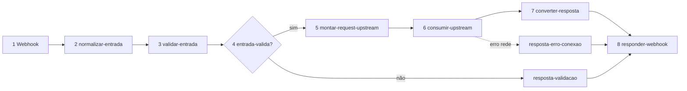

# Orius n8n — Integrações (skill única)

Skill **única** para implementar workflows n8n proxy no Orius.  
**Não** separar por SOAP vs REST — o pipeline é o mesmo; só mudam perfil upstream, montagem do request e conversão da resposta.

**Context root:** `c:\Users\kenio\automacoes e testes`

## Quando usar

- Criar ou estender **qualquer** workflow n8n de integração Orius
- ONR WSOficio, CRA21, CENSEC, CNIB, RIB, SEE TJGO, ONRCPN, CCN, DOI, …
- Subagente de batch (`agent-n8n-batch-orchestrator`) implementando um card

**Não usar** para:
- Tooling n8n (`pull`, `push`, `validate`) → [`.agents/skills/n8n-architect/SKILL.md`](../../.agents/skills/n8n-architect/SKILL.md)
- Orquestração ponta a ponta (8 etapas, Postman, vault, Plane) → [`agent-n8n-orchestrator`](../agent-n8n-orchestrator/SKILL.md)
- Scripts CLI Python/JS de teste ONR (`scripts/`) — referência opcional, não adapter

## Skills complementares (não duplicar)

| Papel | Skill |
|-------|-------|
| n8n-as-code | `n8n-architect` |
| Orquestração 8 etapas | `agent-n8n-orchestrator` |
| Lotes multi-card | `agent-n8n-batch-orchestrator` |
| Nomenclatura Plane/Postman | `padronizacao-nomenclatura-automacao` |
| Vault | `obsidian-vault` |
| Matriz Postman/sync | [`routing-matrix.md`](../agent-n8n-orchestrator/routing-matrix.md) |

## Legado (não carregar para novos workflows)

| Skill antiga | Status |
|--------------|--------|
| `agent-onr-n8n-soap` | Substituída — perfil `soap-onr` abaixo |
| `agent-cra-n8n-soap` | Substituída — perfil `soap-cra` abaixo |
| `agent-censec-n8n` | Substituída — perfil `rest-json` + validações CENSEC |
| `agent-webservice` | Só scripts CLI; **não** é adapter n8n |

---

## Pipeline canônico (todas as integrações)



| Etapa | Nó | Tipo | Responsabilidade |
|-------|-----|------|------------------|
| 1 | `Webhook` / `Receive …` | `webhook` | POST (ou GET quando aplicável), `responseMode: responseNode`, Basic Auth n8n |
| 2 | `normalizar-entrada` | `set` ou `code` | Body **snake_case pt-BR** → campos internos + defaults `$env` |
| 3 | `validar-entrada` | `code` | Regras de negócio; `entrada_valida`, `codigo_erro`, `mensagem_erro` |
| 4 | `if-entrada-valida` | `if` | Ramo válido → upstream; inválido → resposta local |
| 5 | `montar-request-upstream` | `code` | **SOAP:** envelope XML na ordem WSDL · **REST:** URL, headers, body JSON |
| 6 | `consumir-upstream` | `httpRequest` | `onError: continueErrorOutput` (SOAP/REST) |
| 7 | `converter-resposta` | `code` | XML ou JSON upstream → envelope Orius + `status_http` |
| 7b | `resposta-validacao` | `code` | Erros locais (400 típico) |
| 7c | `resposta-erro-conexao` | `code` | Timeout/rede → 502 |
| 8 | `Respond to Webhook` | `respondToWebhook` | `responseCode: ={{ $json.status_http }}` |

**Variações permitidas** (documentar no `desenvolvimento/`):
- REST simples: etapas 5+6 fundidas no `httpRequest` quando não há transformação complexa
- CENSEC: validações extras em cadeia **antes** do `if` (CEP/CESDI/CTP)
- Auth dedicado: pode omitir `montar-request` se body do webhook = body upstream

Template TypeScript: [workflow-template.md](workflow-template.md)  
Perfis por integração: [perfis-upstream.md](perfis-upstream.md)

---

## Contrato HTTP público (JSON)

### Request

- Campos em **snake_case pt-BR** (não PascalCase WSDL)
- Credenciais upstream: preferir `$env` no n8n; body pode sobrescrever quando documentado
- Mapeamento JSON ↔ upstream documentado em `desenvolvimento/{operacao}.md`

### Response — envelope padrão

```json
{
  "status_http": 200,
  "sucesso": true,
  "codigo_erro": 0,
  "mensagem_erro": "",
  "dados": {}
}
```

| Campo | Uso |
|-------|-----|
| `status_http` | Espelha HTTP status line — **obrigatório** |
| `sucesso` | Resultado de negócio (`RETORNO`, `codigo` CRA, HTTP 2xx REST, …) |
| `codigo_erro` / `mensagem_erro` | Código e texto upstream ou validação local |
| `dados` | Payload específico da operação |

**Exceção login ONR:** campos planos no topo (`tokens[]`, `id_usuario`, …) por compatibilidade com Auth ONR existente.

### `status_http` — regras gerais

| Situação | HTTP |
|----------|------|
| Sucesso de negócio | **200** |
| Validação local / body inválido | **400** |
| Auth upstream falhou | **401** |
| Recurso não encontrado | **404** |
| Proibido / inativo | **403** |
| Erro de negócio upstream | **422** |
| Erro sistema / parse inválido | **502** |
| Indisponível upstream | **503** |
| Falha conexão `httpRequest` | **502** |

Mapeamento fino por perfil: [perfis-upstream.md](perfis-upstream.md).

---

## Antes de montar o workflow

1. Resolver integração e perfil (`soap-onr`, `soap-cra`, `rest-json`) — [routing-matrix.md](../agent-n8n-orchestrator/routing-matrix.md)
2. Ler vault: hub da integração + `utilizacao/{operacao}.md` + contrato técnico
3. Registry Plane: `Meta/integracoes/plane/maps/{slug}-work-items.json`
4. Workflow âncora do mesmo perfil (copiar pipeline, não reinventar)
5. Scripts/repo de referência (opcional): `scripts/`, `webservice/`, `wsdl/`, OpenAPI local
6. `npx --yes n8nac env status --json` → `workflowsPath`

### Workflows âncora (referência)

| Perfil | Âncora |
|--------|--------|
| `soap-onr` | `Auth ONR.workflow.ts` |
| `soap-cra` | `Consulta Justificativa CRA.workflow.ts` ou `Consulta CRA.workflow.ts` |
| `rest-json` | `Auth CNIB.workflow.ts`, `Auth RIB.workflow.ts`, `Sessions SEE TJGO.workflow.ts` |
| `rest-json` CENSEC | `CENSEC Upload JSON Gateway.workflow.ts` |

---

## Nomenclatura

| Item | Convenção |
|------|-----------|
| `@workflow({ name })` | `[{IDENTIFICADOR}-n] (<integração>) <Operacao> - <Domínio>` |
| Arquivo | `workflows/n8n/<env>/<Nome legível>.workflow.ts` |
| Nós | kebab-case pt (`validar-entrada`, `consumir-upstream`) |
| Webhook path | `<integracao>/<slug>` — ex. `cra/consulta`, `cnib/auth/token`, `onrcpn/certificate-json/create` |
| Postman | `[{IDENTIFICADOR}-n] …` na pasta proxy da coleção |

---

## Postman — autonomia (criar se ausente)

**Somente** se o JSON da coleção e/ou environment **não existir** no path da matriz:

1. Criar scaffold mínimo em `postman/<integracao>-n8n/` (collection + environment quando aplicável)
2. Pasta proxy: `n8n — proxy <INTEGRAÇÃO>`
3. Variáveis: `n8n_base_url`, credenciais Basic Auth n8n, URLs upstream (sem segredos no vault)
4. Se já existir → **editar**, nunca recriar

Depois: `npm run postman:validate:naming -- <coleção>` · sync conforme matriz.

---

## n8n-as-code (obrigatório)

```bash
npx --yes n8nac skills validate "<workflowsPath>/<arquivo>.workflow.ts"
npx --yes n8nac push "<workflowsPath>/<arquivo>.workflow.ts" --verify
npx --yes n8nac workflow present <workflowId> --json
```

Conflito: `npx --yes n8nac resolve <workflowId> --mode keep-current|keep-incoming` — perguntar ao usuário.

---

## Checklist de entrega (workflow)

- [ ] Pipeline completo (webhook → validação → upstream → resposta + ramos erro)
- [ ] `n8nac skills validate` OK
- [ ] `n8nac push --verify` + ID gravado
- [ ] Request Postman na coleção correta
- [ ] `utilizacao/{operacao}.md` + `desenvolvimento/{operacao}.md` no vault
- [ ] Payload JSON de teste documentado
- [ ] Mapeamento `status_http` documentado no `desenvolvimento/`

---

## Referências

- Template: [workflow-template.md](workflow-template.md)
- Perfis SOAP/REST: [perfis-upstream.md](perfis-upstream.md)
- Padronização: vault `Orius/desenvolvimento/padronizacao-n8n-autonr-plane-postman.md`
- Lista métodos ONR: `webservice/list-metodos.md`
- CRA XML: `scripts/cra/soap-requests/`
