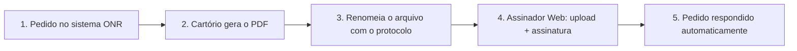

# Assinador Web ONR — Guia resumido (para leigos)

> Baseado no **Manual Assinador Web v2.3** ([assinadorweb.md](./assinadorweb.md)).  
> Site: [oficioeletronico.com.br](https://oficioeletronico.com.br/)

---

## O que é o Assinador Web?

É a ferramenta que o **cartório de Registro de Imóveis** usa para **entregar documentos ao público pela internet** (Ofício Eletrônico / ONR), já no **padrão nacional** de documento eletrônico.

Em termos simples, o cartório **não envia só um PDF comum**: o sistema **assina digitalmente**, coloca **QR Code**, **marca d’água**, **carimbo de tempo**, **certificado de atributo** e um **hash** para o solicitante validar o arquivo depois.

**Quem usa:** funcionários do cartório, com **certificado digital** (e-CPF ou e-CNPJ do cartório) e senha **PIN**.

---

## Ideia geral do fluxo (vale para quase todos os serviços)

Pense no processo em **cinco etapas**:

| Etapa | O que acontece |
|-------|----------------|
| **1. Pedido existe** | Alguém pediu certidão, ofício, penhora, protocolo etc. no sistema (Ofício Eletrônico / centrais ONR). O pedido tem um **número de protocolo** e um **status** (ex.: Em aberto, Prenotado, Pagamento efetivado). |
| **2. Cartório prepara o PDF** | O cartório emite o documento (certidão, resposta, nota de exigência…) no sistema interno ou em outro programa e exporta em PDF. |
| **3. Nome do arquivo** | **Antes de subir**, o arquivo **precisa ter o nome certo** — em geral o **protocolo** (às vezes com sufixo ou hífen). Se o nome estiver errado, aparece **“Arquivo recusado”** e não assina. |
| **4. Assinador Web** | Acessa o site → arrasta os PDFs → confere **“Pronto para assinar”** → informa o PIN → confirma o lote. |
| **5. Resposta automática** | O sistema **liga o PDF assinado ao pedido** e **responde** no Ofício Eletrônico. O lote fica **“Processando pedidos”** e, em cerca de **3 minutos**, passa para **“Concluído”**. O solicitante usa o **hash** para baixar no Registradores/SAEC. |

### Passo a passo na prática (operador do cartório)

1. Entrar em [oficioeletronico.com.br](https://oficioeletronico.com.br/) → **Autenticar com certificado digital** → digitar o **PIN**.
2. Na tela inicial do Assinador, **arrastar** os PDFs (ou clicar para escolher na pasta).
3. Verificar se cada arquivo está **“Pronto para assinar”** (se não, ler o motivo da recusa).
4. Clicar para **assinar** → PIN de novo → **concluir o lote**.
5. Mensagem **“Lote cadastrado com sucesso”** → aguardar ~3 min → status **Concluído**.
6. Opcional: menu **Cartórios → Responder lote** para ver histórico, **hash**, data de processamento e **download** dos arquivos já assinados.

### O que o solicitante recebe

Depois que o lote conclui, o pedido no sistema fica **respondido**. O interessado acessa o documento assinado (com QR Code, marca d’água etc.) usando o **hash do protocolo** no ecossistema **Registradores / SAEC**, conforme o tipo de serviço.

---

## Regra de ouro: o **nome do arquivo** é o “endereço” do pedido

O Assinador **não pergunta** “qual protocolo é este?”. Ele **lê o nome do arquivo** (sem a extensão `.pdf`) e tenta encontrar o pedido correspondente.

| Se o nome estiver… | Resultado |
|------------------|-----------|
| **Correto** e o pedido estiver no **status permitido** | **Pronto para assinar** |
| **Errado** ou pedido em status inadequado | **Arquivo recusado** (com motivo ao lado) |

**Várias matrículas no mesmo protocolo:** use hífen + número da matrícula, por exemplo `S20120000001D-1234`.

**Sufixos com letra** (N, T, X, P, D, E, R, A…): indicam **tipo de resposta** (nota de exigência, talão, XML, negativa de pagamento etc.). A letra vai **no final do protocolo** no nome do arquivo.

---

## Tipos de pedido — o que é cada um e como responder

### 1. Certidão Digital

| | |
|---|---|
| **O que é** | Pedido de **certidão feito pela internet** (portal de certidões / fluxo digital), não no balcão físico. |
| **Status do pedido** | **Em aberto** ou **Processando** |
| **Nome do arquivo** | `S20120000001D` ou `S20120000001D-1234` (protocolo; com hífen se mais de uma matrícula) |
| **Exemplo** | Arquivo: `S20120000001D.pdf` |

**Fluxo em uma frase:** o cidadão pediu certidão online → o cartório gera o PDF → renomeia com o protocolo **S…** → assina no Assinador → o pedido digital fecha sozinho.

---

### 2. Ofício

| | |
|---|---|
| **O que é** | Resposta a **ofício eletrônico** (comunicação oficial entre órgãos/cartório no fluxo do Ofício Eletrônico). |
| **Status do pedido** | **Em aberto** |
| **Nome do arquivo** | `2101000001` ou `2101000001-1234` |
| **Exemplo** | Arquivo: `2101000001.pdf` |

**Fluxo em uma frase:** existe ofício aguardando resposta → cartório anexa o PDF da resposta com o **número do protocolo do ofício** → assina → ofício fica respondido.

---

### 3. Penhora Online — **SPH** (busca / certidão de penhora)

| | |
|---|---|
| **O que é** | Pedido de **busca ou certidão** no módulo de **Penhora Online** (tipo SPH — não confundir com PH abaixo). |
| **Status do pedido** | **Em aberto** ou **Processando** |
| **Nome do arquivo** | `SPH21010000001D` ou `SPH21010000001D-1234` |
| **Exemplo** | Arquivo: `SPH21010000001D.pdf` |

**Fluxo em uma frase:** pedido SPH aberto → cartório emite certidão/busca → nome começa com **SPH** + protocolo → upload só de arquivos **SPH** → assinatura → resposta na Penhora Online.

---

### 4. Penhora Online — **PH** (penhora registrada)

| | |
|---|---|
| **O que é** | Resposta quando a penhora já está no fluxo de **registro/averbação** ou **nota de exigência** no módulo PH. |
| **O que pode enviar** | **Registro/averbação** ou **Nota de exigência** (ver 4.1) |

#### 4a. PH — Registro / averbação

| Situação do processo | Status exigido | Nome do arquivo |
|----------------------|----------------|-----------------|
| Beneficiário de **justiça gratuita** | **Prenotado** ou **Reaberto não concluído** | `PH000007167` |
| Com **pagamento de registro** efetuado | **Pagamento efetivado** | `PH000007167` |

**Fluxo em uma frase:** processo PH no status certo → PDF da certidão/registro com nome **PH** + número do protocolo → assinar → pedido PH atualizado.

#### 4b. PH — Nota de exigência

| | |
|---|---|
| **Status do pedido** | **Prenotado** ou **Reaberto não concluído** |
| **Nome do arquivo** | Protocolo com **N** no final: `PH000007167N` |
| **Exemplo** | Arquivo: `PH000007167N.pdf` |

A letra **N** = **Nota** de exigência.

---

### 5. E-Protocolo (protocolo eletrônico)

| | |
|---|---|
| **O que é** | Pedidos de **pré-protocolo / protocolo eletrônico** (títulos e documentos tramitando no e-Protocolo ONR). |
| **O que pode enviar** | **Nota de exigência**, **registro/averbação**, e em alguns casos **talão/recibo** e **XML** estruturado |

#### 5a. E-Protocolo — Nota de exigência

| | |
|---|---|
| **Status** | **Prenotado** ou **Reaberto não concluído** |
| **Nome do arquivo** | `AC000570464N` (protocolo + **N** no final) |

#### 5b. E-Protocolo — Registro / averbação

| Cenário | Status | Arquivos (nomes sem `.pdf`) |
|---------|--------|-----------------------------|
| Só registro/averbação | **Pagamento efetivado** | `AC000570464` |
| Registro + **talão/recibo** | **Pagamento efetivado** | `AC000570464` e `AC000570464T` |
| Registro + talão + **certidão estruturada XML** | **Pagamento efetivado** | `AC000570464`, `AC000570464T`, `AC000570464X` |
| **Título digital** com várias matrículas | **Pagamento efetivado** | `AC000570464`, `AC000570464-123`, `AC000570464T` (hífen para matrícula extra) |

| Sufixo | Significado |
|--------|-------------|
| *(sem sufixo)* | Documento principal de registro/averbação |
| **T** | Talão / recibo |
| **X** | XML da certidão estruturada (título estruturado) |
| **N** | Nota de exigência |

**Fluxo em uma frase:** o título foi pago ou está prenotado → cartório sobe um ou mais PDFs/XML com os sufixos certos → assina em lote → o e-Protocolo recebe a resposta correspondente.

---

### 6. Certidão — **Balcão RI**

| | |
|---|---|
| **O que é** | Documentos de atendimento **presencial no balcão** do RI, que também podem ser **assinados e padronizados** pelo Assinador (não passam pelo mesmo protocolo “S…” da certidão digital). |
| **Status** | O manual **não exige** status específico como nos pedidos online — o vínculo é pelo **padrão do nome**. |
| **Nome do arquivo** | Palavra-chave + hífen + número (matrícula ou identificador). **Sem acento.** |

| Tipo de documento | Exemplo de nome (minúsculo ou MAIÚSCULO) |
|-------------------|-------------------------------------------|
| Matrícula | `matricula-1234` ou `MATRICULA-1234` |
| Certidão | `certidao-1234` |
| Talão | `talao-1234` |
| Nota de exigência | `notaexig-1234` |

**Fluxo em uma frase:** atendimento no balcão → PDF gerado → renomear `certidao-1234.pdf` (ou matricula/talao/notaexig) → assinar → documento fica no padrão ONR para entrega/arquivo.

**Atenção:** sem número depois do hífen ou com acento (ex.: `certidão-1234`), o sistema **não reconhece**.

---

### 7. Intimação / Consolidação — **SEIC**

| | |
|---|---|
| **O que é** | Fluxo de **intimação e consolidação** (SEIC) — várias **respostas possíveis**, cada uma com **letra no final do protocolo** no nome do arquivo. |

| Resposta | Status do pedido | Sufixo no nome (ex.: protocolo `IN00905472`) |
|----------|------------------|-----------------------------------------------|
| **Nota de exigência** | Qualquer, **exceto Em aberto** | `…CN` → `IN00905472CN` |
| **Negativa de pagamento** | **Intimado** | `…CP` → `IN00905472CP` |
| **Arquivamento por desinteresse** | **Negativa de pagamento** ou **Nota de exigência** | `…CD` → `IN00905472CD` |
| **Intimação em novo endereço** | **Expedição de intimação** | `…CE` → `IN00905472CE` |
| **Registro / averbação** | **Pagamento efetuado** | `…CR` ou `…CR-1234` |
| **Projeção atualizada** | Qualquer, **exceto Em aberto** | `…CA` → `IN00905472CA` |

**Fluxo em uma frase:** o processo SEIC está no status certo para aquele tipo de resposta → PDF com protocolo + letras finais corretas → assinar → movimentação registrada no fluxo de intimação/consolidação.

---

## Consultar lotes já enviados

Menu **Cartórios → Responder lote**:

- Filtrar por **status** ou **período**.
- Ver lotes **já assinados** e abrir detalhes.
- Campos úteis: **tipo de pedido**, **protocolo**, **datas**, **status da assinatura**, **hash** (para o solicitante), **nome do anexo**, **download** individual ou em massa.

---

## Problemas comuns (linguagem simples)

| Sintoma | Causa provável | O que fazer |
|---------|----------------|-------------|
| **Arquivo recusado** | Nome do arquivo não bate com protocolo real, sufixo errado ou pedido no status errado | Conferir tabela acima; abrir o pedido no Ofício Eletrônico e copiar o protocolo exato |
| Lote **processando** por muito tempo | Atualização automática a cada ~3 minutos | Aguardar; se persistir, suporte ONR |
| Assinou mas solicitante não acha | Hash ou canal errado (Registradores/SAEC) | Repassar o **hash** exibido no detalhe do lote |
| Balcão não reconhece | Acento, espaço ou falta do número após o hífen | Usar só `certidao-1234`, `matricula-1234`, etc. |

---

## Tabela rápida — referência de nomenclatura

| Serviço | Exemplo de nome do arquivo | Observação |
|---------|----------------------------|------------|
| Certidão digital | `S20120000001D` / `S20120000001D-1234` | Hífen = outra matrícula no mesmo pedido |
| Ofício | `2101000001` / `2101000001-1234` | Status: Em aberto |
| Penhora SPH | `SPH21010000001D` / `SPH21010000001D-1234` | Só pedidos SPH |
| Penhora PH (registro) | `PH000007167` | Status conforme gratuidade ou pagamento |
| Penhora PH (nota) | `PH000007167N` | **N** no final |
| E-Protocolo (nota) | `AC000570464N` | **N** no final |
| E-Protocolo (talão) | `AC000570464T` | **T** no final |
| E-Protocolo (XML) | `AC000570464X` | **X** no final |
| Balcão RI | `matricula-1234`, `certidao-1234`, `talao-1234`, `notaexig-1234` | Sem acento |
| SEIC | `IN00905472CN`, `…CP`, `…CD`, `…CE`, `…CR`, `…CA` | Cada letra = tipo de resposta |

---

## Contatos (manual oficial)

- **(11) 3195-2299** · **(61) 2780-0800**
- **oficioeletronico@onr.org.br**
- [www.oficioeletronico.org.br](https://www.oficioeletronico.org.br)

---

*Documento de apoio interno. Para telas e imagens passo a passo, use o manual completo [assinadorweb.md](./assinadorweb.md).*
