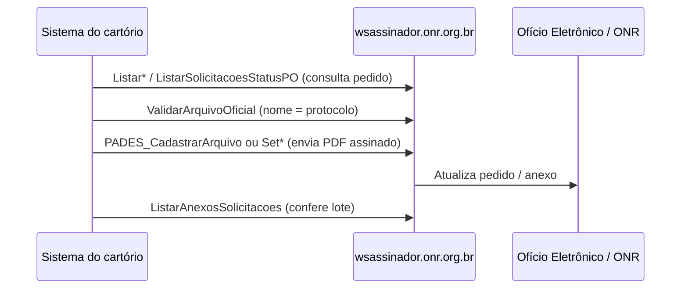

# Manual de endpoints — Web Service Assinador ONR

> **WSDL local:** [../wsdl/assinador-onr.wsdl](../wsdl/assinador-onr.wsdl)  
> **WSDL online:** https://wsassinador.onr.org.br/Assinador.svc?wsdl  
> **Fluxos de negócio (UI):** [assinadorweb-resumo.md](./assinadorweb-resumo.md)

Este documento descreve o **WS Assinador** (`IAssinador`) usado por integrações (software do cartório, automações, n8n). O **Assinador Web** (navegador + certificado A3) usa a **mesma regra de protocolo/nome de arquivo** descrita no resumo; a diferença é que aqui a comunicação é **SOAP/XML**, não upload na tela.

---

## Visão geral

| Item | Valor |
|------|--------|
| **Serviço** | `Assinador` |
| **Contrato** | `IAssinador` |
| **Binding** | `BasicHttpBinding_IAssinador` (SOAP 1.1, document/literal) |
| **Endpoint (WSDL)** | `http://wsassinador.onr.org.br/Assinador.svc` |
| **Namespace SOAP** | `http://wsassinador.arisp.com.br` |
| **Target namespace** | `http://wsassinador.arisp.com.br` |
| **Total de operações** | 32 |

### Esquema típico de integração (paralelo ao Assinador Web)



Na **interface web**, o passo “Validar” aparece como **Pronto para assinar** / **Arquivo recusado**; na API, use `ValidarArquivoOficial` (e, em alguns fluxos, consultas `Listar*` antes).

---

## Como chamar (HTTP + SOAP)

Todas as operações usam o **mesmo URL**; o método é definido pelo elemento raiz do body e pelo header `SOAPAction`.

| Header / campo | Valor |
|----------------|--------|
| **URL** | `http://wsassinador.onr.org.br/Assinador.svc` |
| **Método HTTP** | `POST` |
| **Content-Type** | `text/xml; charset=utf-8` |
| **SOAPAction** | `http://wsassinador.arisp.com.br/IAssinador/{NomeOperacao}` |

**Envelope base:**

```xml
<?xml version="1.0" encoding="utf-8"?>
<soap:Envelope xmlns:soap="http://schemas.xmlsoap.org/soap/envelope/"
               xmlns:tns="http://wsassinador.arisp.com.br">
  <soap:Body>
    <tns:NomeOperacao>
      <!-- campos da operação -->
    </tns:NomeOperacao>
  </soap:Body>
</soap:Envelope>
```

Tipos complexos de resposta usam namespaces adicionais, por exemplo:

- `http://schemas.datacontract.org/2004/07/` — `MensagemRetorno`, listagens genéricas
- `http://schemas.datacontract.org/2004/07/Assinador.DAL.BE` — entidades (`Solicitacao`, `Pedido`, …)
- `http://schemas.datacontract.org/2004/07/WSAssinador` — requests `SetContrato*`, `SetPenhora*`, `PADES_*`

> O WSDL publicado referencia `http://`. Em produção, confirme com a ONR se há redirecionamento ou endpoint `https://` equivalente.

---

## Autenticação e credenciais

O WSDL **não declara** WS-Security, OAuth nem usuário/senha SOAP. A autenticação é por **campos de hash** repassados em cada chamada (mesmo modelo do ecossistema ONR / WSOficio).

| Campo | Onde aparece | Uso provável |
|-------|----------------|--------------|
| `hash` | `ListarSolicitacoes`, `ListarSolicitacoesOficio`, `ListarSolicitacoesPenhora`, `ListarPedidosClientes`, `ListarAnexosSolicitacoes`, `CriptografarDados`, … | Hash de sessão / validação da mensagem (cartório) |
| `Hash` | `ListarSolicitacoesEProtocolo`, `ListarSolicitacoesStatusPO` | Idem (capitalização diferente no XSD) |
| `HASH_Autenticacao` | `SetContrato*`, `SetPenhora*`, `PADES_CadastrarArquivo`, `ObterTokensOficial`, `ValidarArquivoAssinado` | Credencial de autenticação da aplicação |
| `HASH_UDDI` | Mesmas operações `Set*` / `PADES_*` | Identificador UDDI / vínculo da credencial ONR |
| `IDCartorio` / `IdInstituicao` / `idInstituicao` | Várias | Código da serventia no cadastro ONR |
| `TokenUsuario` | `GetTimeStamp`, `GetTimeStampFromBase64` | Token do carimbo de tempo |

**Assinador Web (manual):** certificado digital + PIN no browser — **não substitui** `HASH_*` nas chamadas SOAP; são canais diferentes.

**Obtenção dos hashes:** normalmente via login/credenciamento no **WSOficio** ou documentação ONR da serventia (não estão no WSDL). Códigos de erro como “Hash inválido / expirado” aparecem na especificação WSOficio para métodos irmãos (`SetPenhora*`, `SetContrato*`).

---

## Tipo comum de retorno: `MensagemRetorno`

Presente na maioria das listagens e validações:

| Campo | Tipo | Descrição |
|-------|------|-----------|
| `Codigo` | int | Código de retorno (0 = sucesso em muitos fluxos ONR) |
| `Descricao` | string | Texto explicativo (equivalente ao motivo de “Arquivo recusado” na UI) |

---

## Mapa: fluxo do [assinadorweb-resumo.md](./assinadorweb-resumo.md) → operações SOAP

| Seção do resumo | Nome do arquivo (ex.) | Consultar pedido | Validar antes de enviar | Enviar resposta / arquivo |
|-----------------|----------------------|------------------|-------------------------|---------------------------|
| **1. Certidão digital** | `S20120000001D` | `ListarSolicitacoes` | `ValidarArquivoOficial` | `PADES_CadastrarArquivo` / `InserirAnexoSolicitacao` |
| **2. Ofício** | `2101000001` | `ListarSolicitacoesOficio` | `ValidarArquivoOficial` | `PADES_CadastrarArquivo` |
| **3. Penhora SPH** | `SPH21010000001D` | `ListarSolicitacoesPenhora` | `ValidarArquivoOficial` | `PADES_CadastrarArquivo` |
| **4a. Penhora PH — averbação** | `PH000007167` | `ListarSolicitacoesStatusPO` | `ValidarArquivoOficial` | `SetPenhoraAverbadoPO` |
| **4b. Penhora PH — nota** | `PH000007167N` | `ListarSolicitacoesStatusPO` | `ValidarArquivoOficial` | `SetPenhoraExigenciaPO` |
| **5a. E-Protocolo — nota** | `AC000570464N` | `ListarSolicitacoesEProtocolo` | `ValidarArquivoOficial` | `SetContratoExigenciaAC` |
| **5b. E-Protocolo — averbação** | `AC000570464`, `…T`, `…X` | `ListarSolicitacoesEProtocolo` | `ValidarArquivoOficial` | `SetContratoAverbadoAC` (um call por arquivo) |
| **6. Balcão RI** | `certidao-1234` | — | `ValidarArquivoOficial` | `PADES_CadastrarArquivo` |
| **7. SEIC / Intimação** | `IN00905472CN`, `…CP`, … | — * | `ValidarArquivoOficial` | `PADES_CadastrarArquivo` |
| **Consultar lotes** | — | `ListarPedidosClientes`, `ListarAnexosSolicitacoes` | — | — |

\* SEIC não tem operação `Listar*` dedicada no WSDL; use `ValidarArquivoOficial` com `strProtocolo` completo (incluindo sufixo `CN`, `CP`, etc.).

### Infraestrutura usada em qualquer fluxo assinado

| Etapa do PDF ONR (resumo) | Operação SOAP |
|----------------------------|---------------|
| Carimbo de tempo | `GetTimeStamp`, `GetTimeStamp2`, `GetTimeStampFromBase64` |
| Certificado de atributo | `GerarAtributoAmplia`, `ObterAtributoAmplia` |
| Tokens / metadados oficiais | `ObterTokensOficial` |
| Conferir PDF já assinado | `ValidarArquivoAssinado` |
| Tipo MIME / anexo | `TipoArquivoAssinado`, `TipoAnexoAssinado`, `TipoAnexoTempURL` |

---

## Operações por fluxo de negócio

### 1. Certidão digital

**Resumo:** protocolo `S…`, status *Em aberto* ou *Processando* ([assinadorweb-resumo §1](./assinadorweb-resumo.md)).

#### `ListarSolicitacoes`

Lista pedidos de certidão da instituição.

| Entrada | Tipo | Obrigatório | Descrição |
|---------|------|-------------|-----------|
| `idInstituicao` | int | sim | ID do cartório |
| `protocolo` | string | não | Filtro, ex. `S20120000001D` |
| `hash` | string | sim | Hash de autenticação |

**SOAPAction:** `http://wsassinador.arisp.com.br/IAssinador/ListarSolicitacoes`

**Exemplo de requisição:**

```xml
<tns:ListarSolicitacoes>
  <tns:idInstituicao>12345</tns:idInstituicao>
  <tns:protocolo>S20120000001D</tns:protocolo>
  <tns:hash>SEU_HASH_SESSAO</tns:hash>
</tns:ListarSolicitacoes>
```

**Exemplo de resposta (estrutura):**

```xml
<tns:ListarSolicitacoesResponse>
  <tns:ListarSolicitacoesResult xmlns:d4="http://schemas.datacontract.org/2004/07/"
      xmlns:be="http://schemas.datacontract.org/2004/07/Assinador.DAL.BE">
    <d4:Mensagem>
      <d4:Codigo>0</d4:Codigo>
      <d4:Descricao>OK</d4:Descricao>
    </d4:Mensagem>
    <d4:Solicitacoes>
      <be:Solicitacao>
        <be:Protocolo>S20120000001D</be:Protocolo>
        <be:Matricula>1234</be:Matricula>
        <be:StatusSolicitacao>1</be:StatusSolicitacao>
        <be:DataSolicitacao>2026-06-01T10:00:00</be:DataSolicitacao>
      </be:Solicitacao>
    </d4:Solicitacoes>
  </tns:ListarSolicitacoesResult>
</tns:ListarSolicitacoesResponse>
```

**Campos úteis em `Solicitacao`:** `Protocolo`, `Matricula`, `StatusSolicitacao`, `DataSolicitacao`, `DataResposta`, `IDPedido`, `NomeRazao`, `CPFCNPJ`.

---

#### `ValidarArquivoOficial`

Equivalente API ao **“Pronto para assinar” / “Arquivo recusado”** — valida PDF + protocolo (nome do arquivo sem `.pdf`).

| Entrada | Tipo | Descrição |
|---------|------|-----------|
| `file` | base64Binary | Conteúdo do PDF |
| `strProtocolo` | string | Nome esperado: `S20120000001D` ou `S20120000001D-1234` |

**Exemplo de requisição:**

```xml
<tns:ValidarArquivoOficial>
  <tns:file>JVBERi0xLjQK...</tns:file>
  <tns:strProtocolo>S20120000001D</tns:strProtocolo>
</tns:ValidarArquivoOficial>
```

**Exemplo de resposta:**

```xml
<tns:ValidarArquivoOficialResponse>
  <tns:ValidarArquivoOficialResult>
    <d4:IDCartorio>12345</d4:IDCartorio>
    <d4:Mensagem>
      <d4:Codigo>0</d4:Codigo>
      <d4:Descricao>Arquivo válido para assinatura</d4:Descricao>
    </d4:Mensagem>
    <d4:assinaturaArquivo>...</d4:assinaturaArquivo>
    <d4:token>...</d4:token>
  </tns:ValidarArquivoOficialResult>
</tns:ValidarArquivoOficialResponse>
```

---

#### `PADES_CadastrarArquivo`

Registra PDF no pipeline PAdES (pós-assinatura local ou servidor de assinatura).

**Objeto `oRequest` (`PADES_CadastrarArquivoRequest`):**

| Campo | Tipo | Descrição |
|-------|------|-----------|
| `HASH_Autenticacao` | string | Autenticação ONR |
| `HASH_UDDI` | string | UDDI / credencial |
| `IDCartorio` | int | ID cartório |
| `file` | base64Binary | PDF |

**Exemplo de requisição:**

```xml
<tns:PADES_CadastrarArquivo>
  <tns:oRequest xmlns:wsa="http://schemas.datacontract.org/2004/07/WSAssinador">
    <wsa:HASH_Autenticacao>HASH_AUTH</wsa:HASH_Autenticacao>
    <wsa:HASH_UDDI>HASH_UDDI</wsa:HASH_UDDI>
    <wsa:IDCartorio>12345</wsa:IDCartorio>
    <wsa:file>JVBERi0xLjQK...</wsa:file>
  </tns:oRequest>
</tns:PADES_CadastrarArquivo>
```

**Exemplo de resposta:**

```xml
<tns:PADES_CadastrarArquivoResponse>
  <tns:PADES_CadastrarArquivoResult>
    <d4:OK>true</d4:OK>
    <d4:ID>98765</d4:ID>
    <d4:NomeArquivo>S20120000001D.pdf</d4:NomeArquivo>
    <d4:Erro i:nil="true"/>
  </tns:PADES_CadastrarArquivoResult>
</tns:PADES_CadastrarArquivoResponse>
```

> Após cadastro, o **WSOficio** costuma referenciar o anexo via `DocumentID` / `DocID` nos métodos `*_DocID` da especificação de interoperabilidade.

---

#### `InserirAnexoSolicitacao`

Anexa arquivo a uma solicitação já identificada.

| Campo | Tipo |
|-------|------|
| `IdSolicitacao` | int |
| `NomeArquivo` | string |
| `ExtensaoArquivo` | string |
| `Arquivo` | base64Binary |
| `hash` | string |

**Resposta:** `InserirAnexoSolicitacaoResult` → `MensagemRetorno` (`Codigo`, `Descricao`).

---

### 2. Ofício eletrônico

**Resumo:** protocolo numérico, status *Em aberto* ([§2](./assinadorweb-resumo.md)).

| Operação | Uso |
|----------|-----|
| `ListarSolicitacoesOficio` | Lista pedidos de ofício (`idInstituicao`, `protocolo`, `hash`) |
| `ValidarArquivoOficial` | `strProtocolo` = `2101000001` ou `2101000001-1234` |
| `PADES_CadastrarArquivo` | Envio do PDF assinado |

**`ListarSolicitacoesOficio` — entrada:** igual a `ListarSolicitacoes`, troca apenas o elemento raiz.

**Resposta:** `Solicitacoes` → array de `Pedido` (`Protocolo`, `StatusPedido`, `DtSolicitacao`, `DtResposta`, `Matricula`, `NOficio`, …).

---

### 3. Penhora online — SPH

**Resumo:** prefixo `SPH`, status *Em aberto* / *Processando* ([§3](./assinadorweb-resumo.md)).

| Operação | Uso |
|----------|-----|
| `ListarSolicitacoesPenhora` | Lista pedidos penhora (`protocolo` ex. `SPH21010000001D`) |
| `ValidarArquivoOficial` | Valida nome `SPH…` |
| `PADES_CadastrarArquivo` | Entrega certidão assinada |

**Resposta `ListarSolicitacoesPenhora`:** `Solicitacoes` → `SolicitacaoPenhora` (estrutura análoga em `Assinador.DAL.BE`).

---

### 4. Penhora online — PH

**Resumo:** protocolo `PH…`, averbação ou nota com sufixo `N` ([§4](./assinadorweb-resumo.md)).

#### `ListarSolicitacoesStatusPO`

Consulta status antes de responder (equivale a abrir o pedido PH e ver *Prenotado*, *Pagamento efetivado*, gratuidade, etc.).

| Entrada | Tipo |
|---------|------|
| `ProtocoloPenhora` | string — ex. `PH000007167` ou `PH000007167N` |
| `IdInstituicao` | int |
| `Hash` | string |

**Exemplo de resposta (campos principais):**

```xml
<ListarSolicitacoesStatusPOResult>
  <ProtocoloPedido>PH000007167</ProtocoloPedido>
  <IDPedido>45678</IDPedido>
  <DescricaoStatusCompleto>Pagamento Efetivado</DescricaoStatusCompleto>
  <Prenotado>false</Prenotado>
  <Gratuidade>false</Gratuidade>
  <AssistenciaJudiciariaGratuita>false</AssistenciaJudiciariaGratuita>
  <Matriculas><string>1234</string></Matriculas>
  <Mensagem><Codigo>0</Codigo><Descricao>OK</Descricao></Mensagem>
</ListarSolicitacoesStatusPOResult>
```

---

#### `SetPenhoraAverbadoPO` — registro / averbação PH

**Quando (resumo):** justiça gratuita → *Prenotado* / *Reaberto não concluído*; com pagamento → *Pagamento efetivado*. Arquivo: `PH000007167` (sem `N`).

**`oRequest` (`SetPenhoraAverbadoPO_Request`):**

| Campo | Tipo | Descrição |
|-------|------|-----------|
| `HASH_Autenticacao` | string | |
| `HASH_UDDI` | string | |
| `IDCartorio` | int | |
| `nrProtocolo` | string | `PH000007167` |
| `NomeArquivo` | string | Nome sem extensão ou com `.pdf` conforme integração |
| `Matricula` | string | Obrigatória se várias matrículas (`-1234` no nome) |
| `Resposta` | string | Texto da resposta |
| `file` | base64Binary | PDF assinado |

**Exemplo de requisição:**

```xml
<tns:SetPenhoraAverbadoPO>
  <tns:oRequest xmlns:wsa="http://schemas.datacontract.org/2004/07/WSAssinador">
    <wsa:HASH_Autenticacao>HASH_AUTH</wsa:HASH_Autenticacao>
    <wsa:HASH_UDDI>HASH_UDDI</wsa:HASH_UDDI>
    <wsa:IDCartorio>12345</wsa:IDCartorio>
    <wsa:nrProtocolo>PH000007167</wsa:nrProtocolo>
    <wsa:NomeArquivo>PH000007167</wsa:NomeArquivo>
    <wsa:Matricula>1234</wsa:Matricula>
    <wsa:Resposta>Certidão de registro conforme pedido.</wsa:Resposta>
    <wsa:file>JVBERi0xLjQK...</wsa:file>
  </tns:oRequest>
</tns:SetPenhoraAverbadoPO>
```

**Exemplo de resposta:**

```xml
<tns:SetPenhoraAverbadoPOResponse>
  <tns:SetPenhoraAverbadoPOResult>
    <wsa:OK>true</wsa:OK>
    <wsa:ID>1001</wsa:ID>
    <wsa:Erro i:nil="true"/>
  </tns:SetPenhoraAverbadoPOResult>
</tns:SetPenhoraAverbadoPOResponse>
```

> Fluxo alternativo na interoperabilidade: **WSOficio** `SetPenhoraAverbadoPO` / `SetPenhoraAverbadoPO_DocID` após o arquivo existir no Assinador (`DocumentID`).

---

#### `SetPenhoraExigenciaPO` — nota de exigência PH

**Quando:** *Prenotado* / *Reaberto não concluído*. Arquivo: `PH000007167**N**`.

**`oRequest`:** `HASH_Autenticacao`, `HASH_UDDI`, `IDCartorio`, `nrProtocolo` (`PH000007167N`), `NomeArquivo`, `file` (sem `Matricula`/`Resposta` no XSD).

**Resposta:** `OK`, `ID`, `Erro`.

---

### 5. E-Protocolo (AC…)

**Resumo:** protocolos `AC…`, sufixos `N`, `T`, `X` ([§5](./assinadorweb-resumo.md)).

#### `ListarSolicitacoesEProtocolo`

| Entrada | Tipo |
|---------|------|
| `nrProtocolo` | string — ex. `AC000570464` |
| `IdInstituicao` | int |
| `Hash` | string |

**Resposta:** `Contrato` → `ContratoACResult`: `Protocolo`, `Status`, `IdStatus`, `ID`.

---

#### `SetContratoExigenciaAC` — nota (`…N`)

**`oRequest` (`SetContratoExigenciaAC_Request`):**

| Campo | Tipo |
|-------|------|
| `HASH_Autenticacao`, `HASH_UDDI`, `IDCartorio` | |
| `ProtocoloContrato` | `AC000570464N` |
| `NomeArquivo` | |
| `Descricao`, `Resposta` | string |
| `file` | base64Binary |

**Resposta:** `OK`, `ID`, `NomeArquivo`, `Erro`.

---

#### `SetContratoAverbadoAC` — registro / averbação (`AC…`, `…T`, `…X`)

Mesma estrutura de request que exigência; `ProtocoloContrato` sem `N` para o principal, ou com `T`/`X` para talão/XML.

**Cenários do resumo → chamadas:**

| Arquivos (nome) | Chamadas típicas |
|-----------------|------------------|
| `AC000570464` | Um `SetContratoAverbadoAC` |
| `AC000570464` + `AC000570464T` | Dois calls (protocolos diferentes no `ProtocoloContrato`) |
| + `AC000570464X` | Terceiro call para XML |

---

### 6. Certidão — Balcão RI

**Resumo:** `matricula-1234`, `certidao-1234`, `talao-1234`, `notaexig-1234` ([§6](./assinadorweb-resumo.md)).

| Operação | Uso |
|----------|-----|
| `ValidarArquivoOficial` | `strProtocolo` = `certidao-1234` (sem acento) |
| `PADES_CadastrarArquivo` | Cadastra PDF padronizado ONR |

Não há `Listar*` específico para balcão no WSDL.

---

### 7. SEIC — Intimação / consolidação

**Resumo:** `IN00905472CN`, `…CP`, `…CD`, `…CE`, `…CR`, `…CA` ([§7](./assinadorweb-resumo.md)).

| Operação | Uso |
|----------|-----|
| `ValidarArquivoOficial` | `strProtocolo` com sufixo completo (ex. `IN00905472CN`) |
| `PADES_CadastrarArquivo` | Envio após assinatura |

Validação de **status** (ex. só `…CP` se *Intimado*) é regra de negócio no servidor — espelha a tabela do resumo; confirme `Codigo`/`Descricao` em `ValidarArquivoOficialResult.Mensagem`.

---

### Consultar lotes / histórico (resumo § “Consultar lotes”)

#### `ListarPedidosClientes`

| Campo | Tipo |
|-------|------|
| `IdInstituicao` | int |
| `dtPedidoInicial` | dateTime |
| `dtPedidoFinal` | dateTime |
| `hash` | string |

**Resposta:** `Pedidos` → `PedidoCliente` (`Numero`, `DataPedido`, `ID`, …) + `Mensagem`.

#### `ListarAnexosSolicitacoes`

| Campo | Tipo |
|-------|------|
| `IdSolicitacao` | int |
| `hash` | string |

**Resposta:** `Anexos` → `AnexoSolicitacao` (`ID`, `Nome`, `Extensao`, `IDSolicitacao`, `Chave`, `Descricao`).

Equivale ao detalhe do lote na UI: protocolo, hash, download.

---

## Operações de infraestrutura (todos os fluxos)

### Carimbo de tempo

| Operação | Entrada principal | Saída |
|----------|-------------------|--------|
| `GetTimeStamp` | `TokenUsuario`, `Base64Binary`, `DocumentoSolicitante`, `Protocolo`, `Origem` | `TimestampResponse`: `Timestamp`, `Erro` |
| `GetTimeStamp2` | `tspRequest` (`base64Binary`, `protocolo`, `tokenUsuario`, `origem`, …) | `TimestampResponse` |
| `GetTimeStampFromBase64` | `tspRequestBase64` + demais campos | `TimestampResponse` |

### Certificado de atributo (Amplia)

| Operação | Entrada | Saída |
|----------|---------|--------|
| `ObterAtributoAmplia` | `cpf` | `AtributoJSON`, `ContemAtributo`, `Retorno`, `Erro` |
| `GerarAtributoAmplia` | `dados` (`CPF`, `Nome`, `Funcao`, `DadosCartorio` com CNS, endereço, …) | `AssinadorResponse` |

### Validação e tokens

| Operação | Uso |
|----------|-----|
| `ObterTokensOficial` | `file` + `HASH_Autenticacao` → tokens para assinatura oficial |
| `ValidarArquivoAssinado` | Valida P7S/PDF assinado (`file`, `Protocolo`, `HASH_Autenticacao`, `HASH_UDDI`, `CPF`) → `OK`, `Assinaturas`, `DocumentoBase64` |
| `TipoArquivoAssinado` | Detecta tipo a partir de `fileBase64` |
| `TipoAnexoAssinado` | `IdAnexoP7S` → boolean + `TipoArquivo` |
| `TipoAnexoTempURL` | `TempURL` → boolean + `TipoArquivo` |

### Criptografia (auxiliar)

| Operação | Entrada | Saída |
|----------|---------|--------|
| `CriptografarDados` / `DescriptografarDados` | `dados`, `hash` | `Dado`, `Mensagem` |
| `CriptografarChaveCartorio` / `DescriptografarChaveCartorio` | idem | idem |

### Casos especiais / diagnóstico

| Operação | Uso |
|----------|-----|
| `ObterVersao` | Sem parâmetros → versão do serviço (`ObterVersaoResult` string) |
| `ValidarPedidoCertidaoCDHU` | `codPedido`, `hash` — fluxo CDHU (fora do manual Web v2.3) |
| `GetData` / `GetDataUsingDataContract` | Endpoints de teste WCF — não usar em produção |

---

## Índice rápido de todas as operações

| # | Operação | SOAPAction suffix | Fluxo resumo |
|---|----------|---------------------|--------------|
| 1 | GetData | GetData | — teste |
| 2 | GetDataUsingDataContract | GetDataUsingDataContract | — teste |
| 3 | ObterVersao | ObterVersao | Diagnóstico |
| 4 | ListarAnexosSolicitacoes | ListarAnexosSolicitacoes | Lotes / anexos |
| 5 | ListarPedidosClientes | ListarPedidosClientes | Lotes / período |
| 6 | ListarSolicitacoes | ListarSolicitacoes | Certidão digital |
| 7 | ListarSolicitacoesOficio | ListarSolicitacoesOficio | Ofício |
| 8 | ListarSolicitacoesPenhora | ListarSolicitacoesPenhora | Penhora SPH |
| 9 | InserirAnexoSolicitacao | InserirAnexoSolicitacao | Certidão / anexo |
| 10 | TipoArquivoAssinado | TipoArquivoAssinado | Infra |
| 11 | TipoAnexoAssinado | TipoAnexoAssinado | Infra |
| 12 | TipoAnexoTempURL | TipoAnexoTempURL | Infra |
| 13 | ObterTokensOficial | ObterTokensOficial | Infra |
| 14 | ValidarArquivoOficial | ValidarArquivoOficial | **Todos** (nome = protocolo) |
| 15 | ValidarArquivoAssinado | ValidarArquivoAssinado | Pós-assinatura |
| 16 | ValidarPedidoCertidaoCDHU | ValidarPedidoCertidaoCDHU | CDHU |
| 17 | CriptografarDados | CriptografarDados | Auxiliar |
| 18 | DescriptografarDados | DescriptografarDados | Auxiliar |
| 19 | CriptografarChaveCartorio | CriptografarChaveCartorio | Auxiliar |
| 20 | DescriptografarChaveCartorio | DescriptografarChaveCartorio | Auxiliar |
| 21 | ObterAtributoAmplia | ObterAtributoAmplia | Atributo ONR |
| 22 | GerarAtributoAmplia | GerarAtributoAmplia | Atributo ONR |
| 23 | GetTimeStamp2 | GetTimeStamp2 | Carimbo |
| 24 | GetTimeStamp | GetTimeStamp | Carimbo |
| 25 | GetTimeStampFromBase64 | GetTimeStampFromBase64 | Carimbo |
| 26 | PADES_CadastrarArquivo | PADES_CadastrarArquivo | Certidão, Ofício, SPH, Balcão, SEIC |
| 27 | SetContratoExigenciaAC | SetContratoExigenciaAC | E-Protocolo nota |
| 28 | SetContratoAverbadoAC | SetContratoAverbadoAC | E-Protocolo averbação |
| 29 | ListarSolicitacoesEProtocolo | ListarSolicitacoesEProtocolo | E-Protocolo consulta |
| 30 | ListarSolicitacoesStatusPO | ListarSolicitacoesStatusPO | Penhora PH consulta |
| 31 | SetPenhoraAverbadoPO | SetPenhoraAverbadoPO | Penhora PH averbação |
| 32 | SetPenhoraExigenciaPO | SetPenhoraExigenciaPO | Penhora PH nota |

---

## Relação com WSOficio (Ofício Eletrônico)

Vários fluxos têm **dois caminhos**:

1. **Assinador.svc** — envio direto do arquivo (`SetPenhora*`, `SetContrato*`, `PADES_CadastrarArquivo`).
2. **WSOficio** — métodos `*_DocID` que referenciam `DocumentID` gerado no Assinador Web/API.

Para automação n8n neste repositório, o gateway costuma ser o **WSOficio**; o **wsassinador** é o backend de validação, PAdES, carimbo e cadastro de anexos. Consulte `especificacao_wsoficio_dev.md` para envelopes JSON/SOAP do Ofício e códigos de erro detalhados.

---

## Referências XSD (tipos completos)

Schemas importados pelo WSDL (consulta online):

| XSD | Namespace / conteúdo |
|-----|----------------------|
| `?xsd=xsd0` | Elementos request/response de cada operação |
| `?xsd=xsd2` | `MensagemRetorno`, wrappers de resposta |
| `?xsd=xsd3` | `Solicitacao`, `Pedido`, `AnexoSolicitacao`, … |
| `?xsd=xsd7` | `SetContrato*`, `SetPenhora*`, `PADES_*` |

---

## Limitações deste manual

- Exemplos de **valores** (`HASH_*`, `IdInstituicao`) são placeholders — obtenha credenciais com a ONR.
- Códigos numéricos de `StatusSolicitacao` / `StatusPedido` não estão no WSDL; mapeie com a central ou com retornos reais.
- Respostas XML completas variam conforme versão do serviço; valide com `ObterVersao` e ambiente de homologação.

*Gerado a partir de `wsdl/assinador-onr.wsdl` e XSDs em https://wsassinador.onr.org.br/Assinador.svc?xsd=xsd0,xsd2,xsd3,xsd7.*
