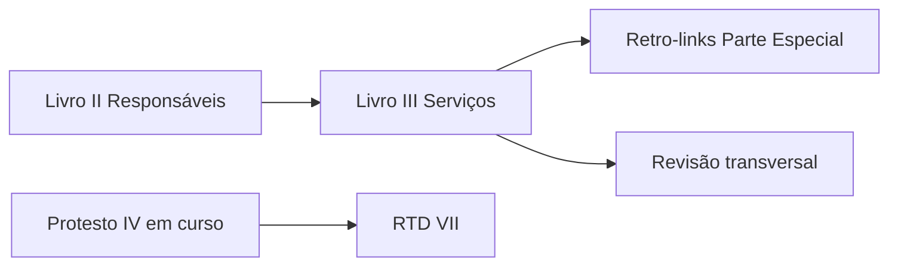

# Planejamento — Livros II e III (Parte Geral)

## Por que priorizar

Os Livros **II** e **III** da **Parte Geral** são a base operacional de **todos** os cartórios extrajudiciais. Enquanto a Parte Especial (Livros IV–IX) disciplina cada serventia, a Parte Geral responde:

| Pergunta | Livro |
|----------|-------|
| **Quem** responde pela serventia (titular, interino, preposto, juiz de paz ad hoc)? | **II** |
| **Como** a serventia funciona no dia a dia (SEE, escrituração, finanças, livros)? | **III** |

Várias notas já carregadas na Parte Especial remetem explicitamente a estes livros — ex.: art. 343 (Notas) → Livro III; art. 650 (RCPN) → Livro II; art. 347 (Notas) → «Parte Geral».

Sem II e III documentados, as regras por produto ficam **descontextualizadas** para leigos e para o time de desenvolvimento.

---

## Escopo normativo

| Livro | Nome no JSON | Arts. | Itens atômicos | Lotes × 15 | Incompletos | dup2 |
|-------|--------------|-------|----------------|------------|-------------|------|
| **II** | DOS RESPONSÁVEIS PELA SERVENTIA EXTRAJUDICIAL E DOS PREPOSTOS | 32–83 | **233** | **16** (último: 8) | 112 (~48%) | 12 |
| **III** | DOS SERVIÇOS EXTRAJUDICIAIS | 84–212 | **436** | **30** (último: 1) | 214 (~49%) | 16 |
| **Total** | | | **669** | **46** | 326 (~49%) | 28 |

**Artefatos de extração (Fase 1):**

- `codigo-normas/_ii_extract_full.json`
- `codigo-normas/_iii_extract_full.json`

**Comando de filtro determinístico:**

```bash
node scripts/extract-normas-livro.cjs --parte=geral II
node scripts/extract-normas-livro.cjs --parte=geral III
```

---

## Mapeamento vault (novos domínios)

Diferente da Parte Especial (1 livro = 1 produto), II e III são **transversais**.

| Livro | Domínio vault | Índice | `produto` | `parte_normativa` |
|-------|---------------|--------|-----------|-------------------|
| II | `responsaveis/` | `00-indice-responsaveis.md` | `transversal` | `parte_geral` |
| III | `servicos-extrajudiciais/` | `00-indice-servicos-extrajudiciais.md` | `transversal` | `parte_geral` |

**Link de produto nas notas** (Impacto Orius / Links internos):

- `[[Orius/empresa/produtos/00-indice-produtos]]` ou referência a `temas-transversais`
- Quando a regra impactar produto específico, acrescentar link contextual (ex.: SEE → todos; escrituração → remissão cruzada com Notas/Protesto)

**Pastas:**

```
regras-de-negocio/
  responsaveis/
    00-indice-responsaveis.md
    regras/
  servicos-extrajudiciais/
    00-indice-servicos-extrajudiciais.md
    regras/
```

O domínio legado `temas-transversais/` permanece como **hub conceitual**; as notas atômicas ficam nos domínios acima para rastreabilidade por livro.

---

## Estrutura por título (priorização temática)

### Livro II — `responsaveis/`

| Título | Tema | Arts. (aprox.) | Prioridade |
|--------|------|----------------|------------|
| I | Notários e registradores (outorga, direitos, deveres, vedações, afastamentos) | 32–42 | **Alta** |
| *(id corrompido `d`)* | Fragmento JSON — tratar como **artefato de fonte**, não inventar título | 43–47 | Média |
| II | Extinção e vacância da delegação | 48–51 | Alta |
| III | Interinos | 52–61 | **Alta** |
| IV | Interventores | 62–67 | Alta |
| V | Prepostos | 68–71 | **Alta** |
| VI | Juiz de paz ad hoc | 72–74 | Média (impacta RCPN) |
| VII | Regime disciplinar | 75–83 | Alta |

### Livro III — `servicos-extrajudiciais/`

| Título | Tema | Arts. (aprox.) | Prioridade |
|--------|------|----------------|------------|
| I | Serventias extrajudiciais (disposições gerais, livros, selo) | 84–113 | **Alta** |
| II | Sistema Extrajudicial Eletrônico (SEE) | 114–136 | **Crítica** (impacta todos os produtos Orius) |
| III | Regras gerais de escrituração | 137–177 | **Crítica** (base de livros/protocolos) |
| IV | Gerenciamento administrativo e financeiro | 178–212 | Alta (emolumentos, ISS, fundos) |

---

## Pipeline operacional (mesmo padrão IV–IX)

### Fase 1 — Filtro ✅

Extração determinística → `_ii_extract_full.json` / `_iii_extract_full.json` (sem interpretação).

### Fase 2 — Geradores (subagentes nativos Cursor)

- Lotes de **15 itens** (`Task` + `generalPurpose`, sem `model`)
- Rodadas de **4 geradores em paralelo**
- Tracking: `codigo-normas/responsaveis-batch-progress.md` · `codigo-normas/servicos-extrajudiciais-batch-progress.md`

**Ajustes de frontmatter vs Parte Especial:**

```yaml
parte_normativa: parte_geral
livro: II   # ou III
produto: transversal
```

Manter: `chave_origem`, anti-alucinação, modelo `rcpn/regras/art-567-inc-i-nascimento.md`.

### Fase 3 — Índice

Estender `scripts/_rebuild-domain-index.cjs` com mapeamento:

- `ii` → `responsaveis`
- `iii` → `servicos-extrajudiciais`

### Fase 4 — Consolidação

- Atualizar `00-indice-regras.md` (hub)
- **Retro-links** nas notas da Parte Especial que citam Livro II/III
- Revisão anti-alucinação em blocos (mesmo critério RCPN Lote 1)

---

## Mapa de lotes — Livro II (16 lotes)

| Lote | items[] | Arts. |
|------|---------|-------|
| 1 | 0–14 | 32–38 |
| 2 | 15–29 | 38–39 |
| 3 | 30–44 | 40–41 |
| 4 | 45–59 | 42–47 |
| 5 | 60–74 | 48–49 |
| 6 | 75–89 | 49–53 |
| 7 | 90–104 | 53–55 |
| 8 | 105–119 | 55–58 |
| 9 | 120–134 | 58–60 |
| 10 | 135–149 | 60–61 |
| 11 | 150–164 | 62–66 |
| 12 | 165–179 | 66–70 |
| 13 | 180–194 | 70–71 |
| 14 | 195–209 | 71–77 |
| 15 | 210–224 | 77–82 |
| 16 | 225–232 | 82–83 (8 itens) |

---

## Mapa de lotes — Livro III (30 lotes)

| Lote | items[] | Arts. |
|------|---------|-------|
| 1 | 0–14 | 84–87 |
| 2 | 15–29 | 87–93 |
| 3 | 30–44 | 93–96 |
| 4 | 45–59 | 96–100 |
| 5 | 60–74 | 100–106 |
| 6 | 75–89 | 106–110 |
| 7 | 90–104 | 110–113 |
| 8 | 105–119 | 114–121 |
| 9 | 120–134 | 121–131 |
| 10 | 135–149 | 131–133 |
| 11 | 150–164 | 133–135 |
| 12 | 165–179 | 137–143 |
| 13 | 180–194 | 144–150 |
| 14 | 195–209 | 151 |
| 15 | 210–224 | 153–157 |
| 16 | 225–239 | 159–163 |
| 17 | 240–254 | 164–169 |
| 18 | 255–269 | 169–174 |
| 19 | 270–284 | 174–176 |
| 20 | 285–299 | 177 |
| 21 | 300–314 | 177 |
| 22 | 315–329 | 177–180 |
| 23 | 330–344 | 180–181 |
| 24 | 345–359 | 181–185 |
| 25 | 360–374 | 186–194 |
| 26 | 375–389 | 195–200 |
| 27 | 390–404 | 200–203 |
| 28 | 405–419 | 203–211 |
| 29 | 420–434 | 211 |
| 30 | 435 | 212 (1 item) |

---

## Riscos da fonte (JSON)

1. **Título corrompido no Livro II** (`id: "d"`) — fragmento de inciso que virou título; preservar `titulo: d` no frontmatter e sinalizar na nota.
2. **~49% trechos incompletos** — mesma política: aviso, sem completar.
3. **Chaves dup2** (arts. 34, redações alternativas) — uma nota por item extraído; slug com sufixo `-dup2` quando aplicável.
4. **Art. 35** — parágrafos fragmentados no JSON (§1º, §2º, parágrafo único separados); tratar cada item como regra atômica isolada.
5. **Numeração sequencial 32–212** na Parte Geral — não confundir com arts. homônimos da Parte Especial.

---

## Ordem de execução recomendada



1. **Concluir Protesto (IV)** — já em andamento (~24 lotes).
2. **Livro II** — 16 lotes; base de pessoas e responsabilidades.
3. **Livro III** — 30 lotes; maior volume, máximo impacto em software (SEE, escrituração, financeiro).
4. **RTD (VII)** — único livro da Parte Especial ainda pendente.
5. **Livro I** (fiscalização/correição) — opcional depois; menos impacto direto no fluxo de atendimento.

**Estimativa de sessões:** II ≈ 4 rodadas de 4 lotes; III ≈ 8 rodadas — total **~12 rodadas** para Parte Geral crítica.

---

## Prompt gerador (trecho — Livro II, Lote N)

Substituir `N`, `X`, `Y`, domínio e livro:

```
Subagente 2 Gerador LOTE N — Livro II (Parte Geral / Responsáveis).

ENTRADA: codigo-normas/_ii_extract_full.json — items[X] até items[Y].

SAÍDA: arquivos em Orius/desenvolvimento/regras-de-negocio/responsaveis/regras/

Frontmatter: parte_normativa parte_geral, livro II, produto transversal, chave_origem.
Anti-alucinação: idem pipeline RCPN/Protesto.
Link: [[Orius/empresa/produtos/00-indice-produtos]] em Impacto Orius.
```

Para Livro III: `_iii_extract_full.json` → `servicos-extrajudiciais/regras/`.

---

## Próximo passo prático

1. Criar índices stub no vault (`responsaveis/`, `servicos-extrajudiciais/`).
2. Atualizar hub `00-indice-regras.md` com Parte Geral.
3. Ao encerrar Protesto IV, **iniciar Livro II Lote 1** (arts. 32–38 — outorga e investidura).
4. Após cada livro: `_rebuild-domain-index.cjs` + revisão amostral.

---

## Referências cruzadas já no vault (amostra)

| Nota existente | Remissão a carregar |
|----------------|---------------------|
| `notas/regras/art-343-*` | Título II, Livro III (escrituração) |
| `notas/regras/art-347-*` | Parte Geral (arquivo/classificadores) |
| `rcpn/regras/art-650-paragrafo-unico-*` | Título VI, Livro II (juiz de paz) |
| `compartilhado/livro-maximo-200-folhas` | Validar arts. do Livro III sobre livros |
