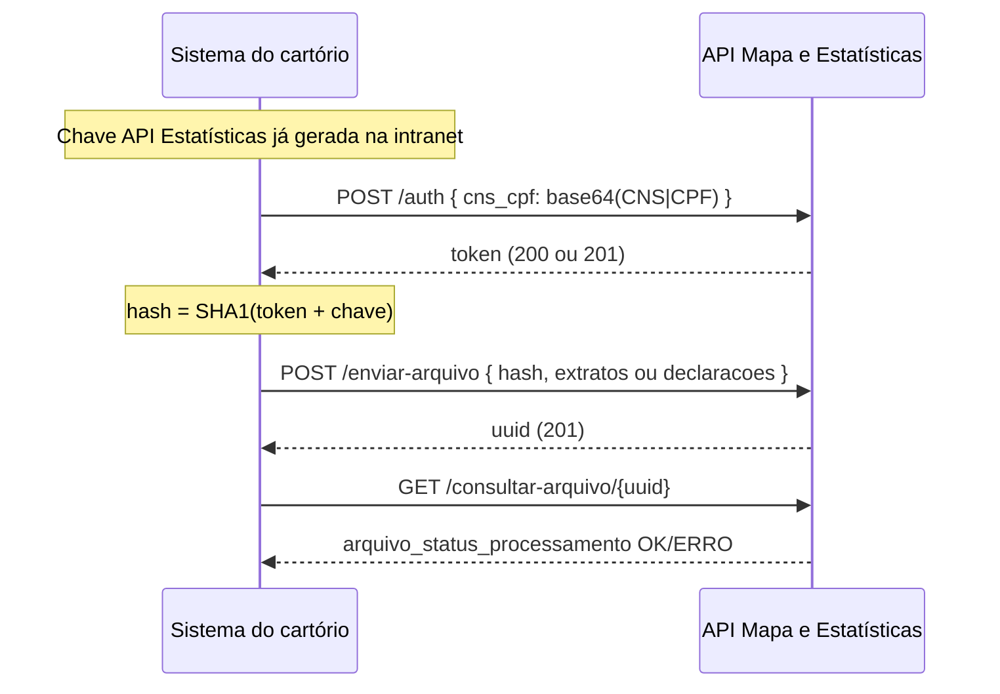

# Guia para leigos: API Mapa e Estatísticas (ONR)

Este guia explica, em linguagem simples, como funciona a API que envia **dados da DOI** (Declaração sobre Operações Imobiliárias) e informações correlatas para o **Mapa do Registro de Imóveis** e o painel de **Estatísticas** do ONR.

Referência técnica extraída do PDF oficial: [documentacao-api-mapa-estatisticas.md](documentacao-api-mapa-estatisticas.md). Resumo operacional legado: [Mapa_e_Estat_sticas_ONR.md](Mapa_e_Estat_sticas_ONR.md).

> **Não confundir** com a [API de polígonos (SIG-RI)](guia-api-poligonos-para-leigos.md), que usa outra base URL, outro tipo de chave e outro fluxo (shapefile).

**Operador:** ONR · **Base URL (produção):** `https://mapa.onr.org.br/api-estatisticas` · **Formato:** JSON em todas as etapas.

---

## Visão geral: para que serve?

Cartórios precisam **informar operações imobiliárias** e dados estatísticos ao ONR (alimentam o Mapa, indicadores e transparência). Em vez de digitar tudo no portal, o **sistema do cartório** pode enviar um **arquivo JSON** por esta API.

Fluxo resumido:

1. **Gerar a chave API Estatísticas** na intranet do Mapa (fica guardada no cartório).
2. **Autenticar** — enviar CNS + CPF do usuário e receber um **token** de uso único (ou reutilizar um ainda não consumido).
3. **Montar o hash** — `SHA1(token + chave_api_estatísticas)`.
4. **Enviar o JSON** — DOI no formato “extratos” **ou** DOIWEB no formato “declarações”, sempre com o `hash` no corpo.
5. **Consultar o processamento** — usar o `uuid` devolvido no envio para ver se deu OK, ERRO ou inconsistências.

---

## Os 3 endpoints (rotas principais)

| # | Método | Caminho | Objetivo |
|---|--------|---------|----------|
| 1 | `POST` | `/auth` | Obter **token** a partir do CNS e CPF do usuário |
| 2 | `POST` | `/enviar-arquivo` | Enviar lote JSON (DOI ou DOIWEB) com **hash** |
| 3 | `GET` | `/consultar-arquivo/{uuid}` | Ver status do processamento do envio |

**Homologação:** o manual ONR indica ambiente de homologação **em preparação**; use produção apenas quando o cartório estiver credenciado.

---

## Geração da chave API Estatísticas

Antes de qualquer chamada programática, alguém autorizado no cartório deve criar a **chave única** no portal.

| Item | Detalhe |
|------|---------|
| Onde | Intranet: [https://mapa.onr.org.br/intranet](https://mapa.onr.org.br/intranet) |
| Menu | **Configurações → Chave API Estatísticas** |
| Ação | Botão **Gerar Chave** → confirmar **Estou ciente** |
| Efeito | Nova chave é criada e a **chave anterior é inativada** automaticamente |
| Uso | Copiar com **Copiar Chave** e guardar em cofre de segredos do sistema |

**Importante:** esta chave **não** é a mesma da “Chave API para envio de polígonos”. São módulos diferentes na intranet.

A chave entra no cálculo do **hash** de cada envio (junto com o token). Sem chave gerada na intranet, a autenticação retorna HTTP **406** (conforme manual).

---

## Autenticação e o hash (conceitos)

### Duas peças secretas

| Peça | Origem | Papel |
|------|--------|------|
| **Token** | Resposta do endpoint `/auth` | Prova que o usuário (CNS + CPF) pode usar a API naquele momento |
| **Chave API Estatísticas** | Intranet (geração manual) | Segredo fixo do cartório usado em todo envio |

### Como montar o `cns_cpf` (só no `/auth`)

O corpo da autenticação leva o CNS e o CPF do usuário concatenados com **pipe** (`|`), em **Base64**:

```
Texto:  {CNS}|{CPF}
Exemplo: 999999|94683200066
Base64:  OTk5OTk5fDk0NjgzMjAwMDY2
```

### Como montar o `hash` (no `/enviar-arquivo`)

Depois de obter o **token** string retornado pelo `/auth`:

```
hash = SHA1( token + chave_api_estatísticas )
```

Exemplo ilustrativo do manual (valores fictícios):

```text
token = "$2y$12$tgbYuxTNM7BTJ9Oxs5sEuFCWdrjPb3bQjtEBi6rxJgje"
chave = "$1$Jiyopnge$VaPfrXXuVIYIR4w6tDl"
hash  = sha1(token + chave)  →  "93104779dfbe834853c7a2146f5b5cb7821e8340"
```

**Regra de negócio:** cada **hash** válido costuma ser de **uso único** no envio. Se o hash já foi usado ou expirou, o envio retorna **401** (manual).

**Comportamento do token (manual):**

- Se já existe token gerado e **ainda não utilizado**, nova chamada a `/auth` pode devolver o **mesmo** token (HTTP **200**).
- Se não há token ou o anterior já foi consumido, gera **novo** token (HTTP **201**).

---

## Endpoint 1 — Autenticação (`POST /auth`)

### Objetivo

Validar o usuário (CNS + CPF) e devolver o **token** necessário para calcular o hash do envio.

### URL

```http
POST https://mapa.onr.org.br/api-estatisticas/auth
```

### Cabeçalhos

| Cabeçalho | Valor |
|-----------|--------|
| `Content-Type` | `application/json` |

### Corpo da requisição (schema)

| Campo | Tipo | Obrigatório | Descrição |
|-------|------|-------------|-----------|
| `cns_cpf` | string | sim | Base64 de `{CNS}\|{CPF}` (somente dígitos no CPF, sem máscara) |

**Exemplo de body:**

```json
{
  "cns_cpf": "OTk5OTk5fDk0NjgzMjAwMDY2"
}
```

**JSON Schema (equivalente):**

```json
{
  "$schema": "http://json-schema.org/draft-07/schema#",
  "type": "object",
  "required": ["cns_cpf"],
  "properties": {
    "cns_cpf": {
      "type": "string",
      "description": "Base64(CNS + '|' + CPF)"
    }
  },
  "additionalProperties": false
}
```

### Respostas de sucesso

O manual não reproduz o JSON completo do token no markdown convertido; na prática a resposta contém o **valor do token** (string longa) para usar no `SHA1`.

| HTTP | Situação |
|------|----------|
| **201** | Novo token gerado |
| **200** | Já existia token válido ainda não utilizado — retorna o anterior |

**Exemplo ilustrativo** (estrutura típica — confirmar no ambiente real):

```json
{
  "token": "$2y$12$tgbYuxTNM7BTJ9Oxs5sEuFCWdrjPb3bQjtEBi6rxJgje"
}
```

### Erros documentados (sem corpo no PDF — apenas códigos)

| HTTP | Causa provável |
|------|----------------|
| **405** | Método diferente de POST |
| **400** | JSON inválido ou `cns_cpf` inválido |
| **403** | `cns_cpf` não informado |
| **401** | Usuário sem permissão para a API |
| **406** | Chave API Estatísticas **não gerada** na intranet |

---

## Endpoint 2 — Enviar arquivo (`POST /enviar-arquivo`)

### Objetivo

Enviar um lote de declarações/ extratos de DOI em JSON. O mesmo endpoint aceita **dois formatos** de payload (não são rotas diferentes).

### URL

```http
POST https://mapa.onr.org.br/api-estatisticas/enviar-arquivo
```

### Cabeçalhos

| Cabeçalho | Valor |
|-----------|--------|
| `Content-Type` | `application/json` |

### Variante A — DOI JSON (formato “extratos”)

Usado quando o JSON segue o layout clássico por **extrato** (operação + alienantes + adquirentes).

**Limite:** no máximo **1.000 extratos** por requisição. Acima disso o arquivo é marcado com erro e **não importa**.

**Schema de alto nível:**

| Campo | Tipo | Obrigatório | Descrição |
|-------|------|-------------|-----------|
| `hash` | string | sim | `SHA1(token + chave)` |
| `dataEnvio` | string | sim | Data do envio (ex.: `15/10/2019`) |
| `sequencial` | string | sim | Identificador sequencial do lote no cartório |
| `extratos` | array | sim | Lista de operações (máx. 1000) |

Cada item de `extratos`:

| Campo | Tipo | Descrição |
|-------|------|-----------|
| `cns` | string | CNS da serventia do extrato |
| `operacao` | object | Dados da operação imobiliária (matrícula, valores, endereço, tipos…) |
| `alienantes` | array | Partes alienantes — **obrigatório existir**, pode ser `[]` |
| `adquirentes` | array | Partes adquirentes — **obrigatório existir**, pode ser `[]` |

**Exemplo de requisição (resumido do manual):**

```json
{
  "hash": "93104779dfbe834853c7a2146f5b5cb7821e8340",
  "dataEnvio": "15/10/2019",
  "sequencial": "0001",
  "extratos": [
    {
      "cns": "999992",
      "operacao": {
        "numero_controle": "0",
        "data_lavratura": "01/01/2018",
        "livro": "2",
        "folha": "12",
        "matricula": "63767",
        "registro": "1",
        "situacao": "0",
        "atribuicao_doi": "2",
        "tipo_transacao": "11",
        "descricao_tipo_transacao": "Outros",
        "retificacao_ato": "0",
        "data_alienacao": "29/09/2017",
        "forma_alienacao_aquisicao": "5",
        "valor_nao_consta_documentos": "0",
        "valor_alienacao_aquisicao": "103790,00",
        "base_calculo_itbi": "124740,00",
        "tipo_imovel": "17",
        "descricao_tipo_imovel": "Outros",
        "situacao_construcao": "0",
        "localizacao": "1",
        "area_nao_consta": "1",
        "area_imovel": "0",
        "endereco_imovel": "AVENIDA MARIAT ERESA",
        "numero_imovel": "260",
        "complemento_imovel": "SL5 10",
        "bairro_imovel": "CAMPO GRANDE",
        "cep_imovel": "20000000",
        "municipio_imovel": "RIO DE JANEIRO",
        "uf_imovel": "RJ",
        "inscricao_nirf": "32385171",
        "valor_itbi_nao_consta_nos_documentos": "0"
      },
      "alienantes": [
        {
          "cpf_cnpj": "73155455063",
          "participacao_na_operacao": "100,00",
          "cpf_procurador": "19801776005"
        }
      ],
      "adquirentes": [
        {
          "cpf_cnpj": "76596482090",
          "participacao_na_operacao": "50,00",
          "cpf_procurador": "19801776005"
        },
        {
          "cpf_cnpj": "01107774098",
          "participacao_na_operacao": "50,00",
          "cpf_procurador": "19801776005"
        }
      ]
    }
  ]
}
```

Campos dentro de `operacao`, `alienantes` e `adquirentes` têm **tamanhos e validações** específicos (seção 6 do manual oficial — tabelas no PDF).

### Variante B — DOIWEB JSON (formato “declarações”)

Layout mais rico, com **indicadores booleanos**, cônjuge, representantes, etc. Adequado quando o sistema exporta no padrão DOIWEB.

**Schema de alto nível:**

| Campo | Tipo | Obrigatório | Descrição |
|-------|------|-------------|-----------|
| `hash` | string | sim | Mesmo cálculo SHA1 |
| `declaracoes` | array | sim | Lista de declarações DOIWEB |

Cada declaração inclui, entre outros: `alienantes`, `adquirentes`, dados do imóvel (`areaImovel`, `cep`, `matricula`, `tipoImovel`…), operação (`tipoOperacaoImobiliaria`, valores, datas), `municipiosUF`, indicadores (`indicadorPermutaBens`, etc.).

**Exemplo de requisição (trecho — ver manual completo para todos os campos):**

```json
{
  "hash": "93104779dfbe834853c7a2146f5b5cb7821e8340",
  "declaracoes": [
    {
      "adquirentes": [
        {
          "cpfConjuge": "00000000000",
          "cpfInventariante": "00000000000",
          "indicadorConjuge": false,
          "indicadorConjugeParticipa": false,
          "indicadorCpfConjugeIdentificado": false,
          "indicadorEspolio": false,
          "indicadorEstrangeiro": false,
          "indicadorNaoConstaParticipacaoOperacao": false,
          "indicadorNiIdentificado": false,
          "indicadorRepresentante": false,
          "motivoNaoIdentificacaoNi": 0,
          "ni": "",
          "nome": "Nome da parte",
          "nomeConjuge": "",
          "nomeInventariante": "",
          "participacao": 100,
          "regimeBens": "1",
          "representantes": [{ "ni": "", "nome": "" }]
        }
      ],
      "alienantes": [
        {
          "cpfConjuge": "00000000000",
          "nome": "Nome da parte",
          "participacao": 100,
          "regimeBens": "1",
          "representantes": [{ "ni": "", "nome": "" }]
        }
      ],
      "areaConstruida": 0,
      "areaImovel": 0,
      "cep": "00000000",
      "matricula": "",
      "tipoImovel": "67",
      "tipoOperacaoImobiliaria": "11",
      "valorOperacaoImobiliaria": 0.0,
      "valorParteTransacionada": 100.0
    }
  ]
}
```

> Para implementação, use o exemplo integral em [documentacao-api-mapa-estatisticas.md](documentacao-api-mapa-estatisticas.md) ou [Mapa_e_Estat_sticas_ONR.md](Mapa_e_Estat_sticas_ONR.md).

### Resposta de sucesso (HTTP 201)

```json
{
  "mensagem": "Arquivo enviado com sucesso.",
  "uuid": "2229181396025dad9f752d89c9.27409072",
  "status": "201"
}
```

Guarde o **`uuid`** para o endpoint 3.

### Erros documentados no envio

| HTTP | Causa provável |
|------|----------------|
| **405** | Método diferente de POST |
| **400** | JSON inválido ou **hash** inválido |
| **403** | Campo `hash` ausente |
| **401** | Hash **expirado ou já utilizado** |
| **500** | Erro interno no servidor ONR |

---

## Endpoint 3 — Consultar processamento (`GET /consultar-arquivo/{uuid}`)

### Objetivo

Depois do envio, verificar se o lote foi aceito, processado com sucesso, rejeitado ou ficou com **inconsistências** em registros individuais.

### URL

```http
GET https://mapa.onr.org.br/api-estatisticas/consultar-arquivo/{uuid}
```

Substitua `{uuid}` pelo valor retornado no passo 2 (ex.: `2229181396025dad9f752d89c9.27409072`).

### Cabeçalhos

Não exige body. Envie apenas o método **GET**.

### Parâmetros

| Nome | Onde | Obrigatório | Descrição |
|------|------|-------------|-----------|
| `uuid` | path | sim | Identificador do envio |

### Resposta de sucesso (HTTP 200) — processamento OK

```json
{
  "dados_arquivo": {
    "arquivo_uuid": "7243603176025dd18091c9.83878922",
    "arquivo_data_envio": "15/10/2019 15:54:43",
    "arquivo_status_envio": "OK",
    "arquivo_status_processamento": "OK",
    "descricao_erro": "",
    "arquivo_nome_original": "JSON_API",
    "arquivo_nome_salvo": "999992_sinter_estatistica_json_20191015_155443_c3b30c31bac9905a3f93e76ad2d477c39e0497ef.json",
    "arquivo_tamanho": "2.11 KB",
    "arquivo_inconsistencias": "Registro(s) com inconsistência(s):1ª operação. Campo data da lavratura",
    "cartorio_nome": "Nome do Cartório",
    "cartorio_comarca": "Ilhéus",
    "cartorio_estado": "Bahia",
    "cartorio_cns": "999992",
    "cartorio_ddd_telefone": "12",
    "cartorio_telefone": "3900-1111",
    "cartorio_email_principal": "teste@webcartorios.com.br",
    "usuario_nome": "Nome de usuário"
  },
  "status": "200"
}
```

### Como interpretar os campos principais

| Campo | Valores | Significado para o leigo |
|-------|---------|---------------------------|
| `arquivo_status_envio` | `OK` | O arquivo chegou ao servidor |
| `arquivo_status_processamento` | `OK` | Processamento concluído sem erro fatal |
| `arquivo_status_processamento` | `ERRO` | Falha — ler `descricao_erro` |
| `arquivo_inconsistencias` | texto ou vazio | Avisos em registros específicos (pode vir preenchido mesmo com `OK`) |
| `descricao_erro` | texto | Detalhe quando `ERRO` |

### Exemplo — processamento com ERRO (lote duplicado)

HTTP ainda pode ser **200**, com `arquivo_status_processamento`: `ERRO`:

```json
{
  "dados_arquivo": {
    "arquivo_uuid": "2084421673835de90b297b5915.13417688",
    "arquivo_status_envio": "OK",
    "arquivo_status_processamento": "ERRO",
    "descricao_erro": "Erro na validação do arquivo ... Erro, o arquivo enviado possui dados de um lote já enviado, os campos duplicados foram: CNS, Sequencial e Data Envio",
    "arquivo_inconsistencias": ""
  },
  "status": "200"
}
```

### Exemplo — erro crítico

```json
{
  "dados_arquivo": {
    "arquivo_status_processamento": "ERRO",
    "descricao_erro": "Erro crítico, entrar em contato com o Suporte Técnico."
  },
  "status": "200"
}
```

### Erros documentados na consulta

| HTTP | Causa provável |
|------|----------------|
| **405** | Método diferente de GET |
| **400** | `uuid` inválido |

---

## Fluxo completo (diagrama)



---

## Validações (resumo)

O manual dedica a **seção 6** a tabelas de validação campo a campo:

| Bloco | Formato | Observação |
|-------|---------|------------|
| 6.1 | DOI JSON | `operacao`, `alienantes`, `adquirentes` — tamanhos máximos e regras por código |
| 6.2 | DOIWEB JSON | Dados iniciais, operação, imóvel, partes — muitos campos booleanos |

Regras gerais citadas no manual:

- Chaves `alienantes` e `adquirentes` **devem existir** em cada registro, mesmo que arrays vazios.
- Valores monetários no formato DOI clássico costumam usar **vírgula** decimal (ex.: `"103790,00"`).
- Datas no padrão `dd/mm/aaaa` no formato extratos.

Para implementação rigorosa, consulte as tabelas do PDF / [documentacao-api-mapa-estatisticas.md](documentacao-api-mapa-estatisticas.md) seção 6.

---

## Mapa ONR: duas APIs lado a lado

| | **Mapa e Estatísticas** (este guia) | **Polígonos / SIG-RI** |
|---|-------------------------------------|-------------------------|
| Base | `.../api-estatisticas` | `.../sistemas/api/v1/poligonos` |
| Dado enviado | JSON DOI / DOIWEB | Shapefile (.shp…) |
| Chave na intranet | Chave API **Estatísticas** | Chave API **envio de polígonos** |
| Auth | `cns_cpf` → token → hash SHA1 | Bearer token (15 dias) |
| Finalidade | Estatísticas, DOI no Mapa | Geometria de imóveis no Mapa |

---

## Glossário rápido

| Termo | Significado |
|-------|-------------|
| **DOI** | Declaração sobre Operações Imobiliárias |
| **DOIWEB** | Layout estendido de declaração com indicadores e estrutura web |
| **CNS** | Código Nacional da Serventia |
| **Extrato** | Um registro de operação no formato JSON clássico |
| **Hash** | `SHA1(token + chave)` — “senha de uso” de cada envio |
| **UUID** | Identificador do lote para consulta posterior |
| **IERI-e / Mapa** | Painéis que consomem esses dados agregados |

---

## Onde tirar dúvidas

- **Mapa / APIs:** [mapa@onr.org.br](mailto:mapa@onr.org.br)
- **Postman de referência:** link na nota [Mapa_e_Estat_sticas_ONR.md](Mapa_e_Estat_sticas_ONR.md)

---

## Documentos nesta pasta (`mapa-onr/`)

| Arquivo | Conteúdo |
|---------|----------|
| [guia-api-mapa-estatisticas-para-leigos.md](guia-api-mapa-estatisticas-para-leigos.md) | Este guia |
| [documentacao-api-mapa-estatisticas.md](documentacao-api-mapa-estatisticas.md) | Conversão integral do PDF ONR |
| [guia-api-poligonos-para-leigos.md](guia-api-poligonos-para-leigos.md) | API de polígonos (outra integração) |
