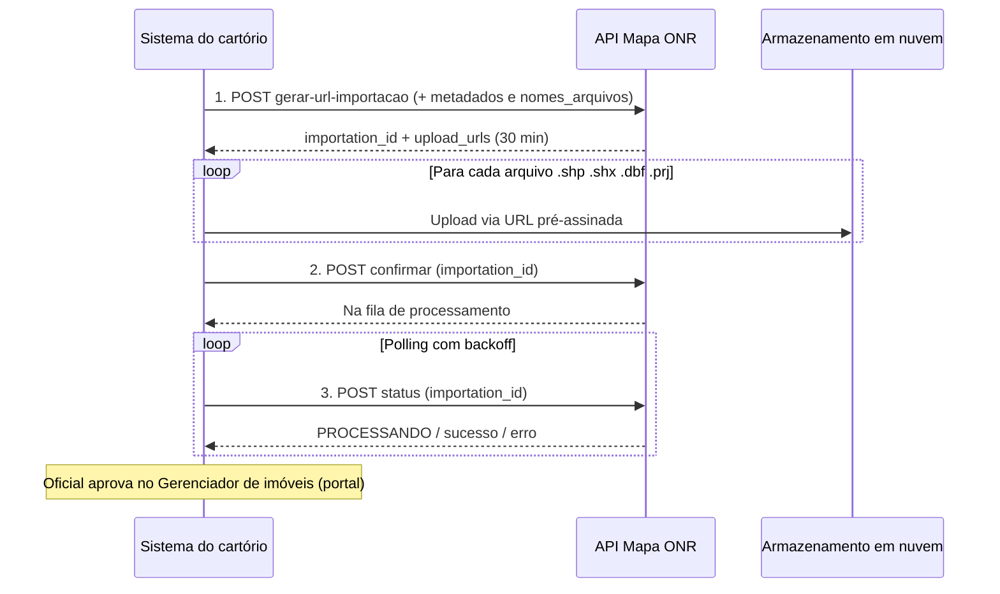

# Guia para leigos: API de polígonos do Mapa do Registro de Imóveis

Este texto explica, em linguagem simples, o que são os principais conceitos do ecossistema geográfico do Registro de Imóveis e **como a API de envio de polígonos** se encaixa nesse mundo. A base normativa e operacional está no [Manual Técnico Operacional do Mapa](manual-tecnico-mapa-v12.md) (Provimento CNJ nº 195/2025); os detalhes técnicos da API estão no [Manual API para Envio dos Polígonos](manual-api-envio-poligonos.md).

**Quem opera o quê:** o **ONR** (Operador Nacional do Registro Eletrônico de Imóveis) administra o **Mapa** em [mapa.onr.org.br](https://mapa.onr.org.br). Cartórios, profissionais técnicos e sistemas integrados enviam e analisam polígonos por lá.

---

## Visão geral: o que a API faz?

Imagine que o cartório (ou um software usado pelo cartório) precisa **mandar o desenho digital de um terreno** para o Mapa, sem alguém clicar tela por tela. A **API de polígonos** é o “correio automático” para isso.

Em resumo, o fluxo é:

1. **Chave de acesso** — alguém autorizado no cartório gera um token no portal (válido por **15 dias**).
2. **Pedir permissão de envio** — o sistema informa metadados (urbano/rural, protocolo, classificação) e os nomes dos arquivos do shapefile.
3. **Enviar os arquivos** — a API devolve endereços temporários (30 minutos) para upload dos 4 arquivos: `.shp`, `.shx`, `.dbf`, `.prj`.
4. **Confirmar** — avisa que o upload terminou; o Mapa coloca o lote na fila de processamento.
5. **Consultar status** — o sistema pergunta de tempos em tempos se já processou, deu erro ou concluiu.
6. **Aprovação humana no cartório** — mesmo com sucesso técnico, o **oficial** ainda analisa, aprova e define se o polígono fica público no mapa.

A API **não substitui** o registrador: ela só entrega a geometria e os dados no sistema; a decisão registral continua no cartório.

A documentação detalhada dos **3 endpoints** (requisição, resposta, shapefile e erros) está na seção [API de polígonos: os 3 endpoints](#api-de-polígonos-os-3-endpoints).

---

## SIG-RI

**SIG-RI** significa **Sistema de Informações Geográficas do Registro de Imóveis**.

Pense no SIG-RI como o “**cérebro geográfico**” do Registro de Imóveis: é onde se **recebe, guarda, cruza e mostra** informação de imóvel que tem localização no mapa (coordenadas, limites, camadas).

No dia a dia, o SIG-RI aparece como o **Mapa do Registro de Imóveis**:

| Onde você vê | O que é |
|--------------|---------|
| [mapa.onr.org.br](https://mapa.onr.org.br) (área pública) | Mapa para consulta: imóveis, cartórios, camadas temáticas |
| Intranet (botão “Entrar” + certificado digital) | Área restrita: serventia e profissional técnico enviam e gerenciam polígonos |
| [mapa.onr.org.br/sigri/sigri](https://mapa.onr.org.br/sigri/sigri) | Ambiente do profissional técnico para envio em lote |

O manual técnico deixa claro: **IERI-e** e **SIG-RI** foram criados pelo Provimento 195 e se materializam no Mapa. Ou seja: quando falamos “mandar polígono para o Mapa”, estamos falando de alimentar o **SIG-RI**.

**Ligação com a API:** a API é um **canal automático** para o SIG-RI receber shapefiles. O envio manual (portal) e o envio por API chegam ao mesmo destino — o gerenciador de imóveis do cartório — mas a API serve para o **software do cartório** (sistema de protocolo, gestão registral etc.) enviar em lote sem retrabalho manual.

---

## Polígono

**Polígono**, neste contexto, não é “figura de matemática genérica”. É o **contorno fechado do imóvel no mapa**: a linha que fecha a área do terreno (casa, lote, fazenda), com pelo menos três vértices (cantos).

### Por que o polígono importa?

A lei e o Provimento passaram a exigir que **vários atos registrais** (loteamento, desmembramento, usucapião, imóvel rural, retificação etc.) venham com **representação georreferenciada**. Em muitos casos, **sem polígono no Mapa o título nem entra na fila de qualificação** do registrador.

### Como o polígono “viaja” até o sistema?

| Forma | Quem usa | Observação |
|-------|----------|------------|
| **Shapefile** (4 arquivos: `.shp`, `.shx`, `.dbf`, `.prj`) | Profissional técnico, serventia, **API** | Formato preferencial; atributos (matrícula, endereço, SIGEF…) podem ir no `.dbf` |
| Coordenadas (graus decimais) | Profissional técnico, serventia | Digitadas ou coladas do memorial |
| Desenho no mapa | Serventia | Traço manual sobre imagem de satélite |
| KML/KMZ | Principalmente serventia | Também aceito em importação em lote |
| Importação do SIGEF/SNCI | Serventia | Polígono já certificado pelo INCRA |

Regras importantes para o polígono ser aceito:

- Deve ser **fechado** (sem linhas soltas).
- Coordenadas em **SAD69** ou **SIRGAS2000**.
- Não aceita **.dwg** diretamente.
- Área e perímetro calculados pelo Mapa são **referência**, não substituem o levantamento de campo.

### Depois do envio (portal ou API)

1. Polígono entra como **pendente de análise**.
2. Oficial verifica sobreposições, documentos e qualificação registral.
3. Oficial marca **aprovado** e define **nível de publicidade** (só cartório, todos os oficiais, ou público na internet).
4. Só então o imóvel compõe o **mosaico** visível conforme a regra de publicidade.

**Ligação com a API:** a API envia exatamente esse “pacote” de polígono (shapefile + metadados como urbano/rural, número da prenotação, classificação do ato). Os **detalhes da matrícula e do proprietário** costumam vir nos **atributos do shapefile** (campos como `MATRICULA`, `CNS`, `ENDERECO`, `SIGEF` etc.) ou são completados depois no portal.

---

## INCRA

O **INCRA** (Instituto Nacional de Colonização e Reforma Agrária) é o órgão federal que regula, entre outras coisas, o **georreferenciamento de imóveis rurais** e a **certificação** de que um levantamento atende às normas técnicas (sobreposição com vizinhos, precisão de vértices etc.).

No Mapa, o INCRA aparece porque:

- Imóveis rurais devem seguir normas e manuais do INCRA (por exemplo MTGIR — Manual Técnico de Georreferenciamento de Imóveis Rurais).
- Profissionais que fazem certificação rural precisam estar **credenciados** junto ao INCRA (consulta pública de credenciados).
- Os sistemas **SIGEF** e **SNCI** são do universo INCRA e alimentam camadas que o cartório consulta e pode importar.

O Mapa **não é o INCRA**: é o Registro de Imóveis integrando dados fundiários. O registrador usa o INCRA/SIGEF como **fonte técnica e de confiança** para imóveis rurais, especialmente os **Categoria A** (com certificação ou ART).

**Ligação com a API:** ao enviar polígono rural pela API, o cartório continua responsável por conferir se o levantamento está adequado; o campo `SIGEF` no shapefile (quando existir) ajuda a **ligar** aquele polígono à certificação INCRA já existente. A API em si não certifica — só transporta geometria e metadados.

---

## SIGEF

**SIGEF** = **Sistema de Gestão Fundiária do INCRA** ([sigef.incra.gov.br](https://sigef.incra.gov.br/)).

É o sistema **atual** (desde 23/11/2013, em geral) onde se faz e consulta a **certificação georreferenciada** de imóveis rurais sob a 3ª norma técnica do INCRA. Cada certificação tem um código longo (formato UUID, 32 caracteres) no memorial descritivo.

### SIGEF x SNCI (não confundir)

| Sistema | Período típico | Situação hoje |
|---------|----------------|---------------|
| **SNCI** | ~2004–2013 | Não recebe certificações novas; certificações antigas ainda válidas |
| **SIGEF** | Nov/2013 em diante | Sistema vigente para certificação rural |

No Mapa existe o módulo **“Imóveis rurais (INCRA)”**: o oficial vê polígonos SIGEF/SNCI na área do cartório, confere sobreposição e pode **importar** para a camada do Registro de Imóveis (mosaico da serventia).

Situações que o manual descreve:

- **Registrada** — já tem matrícula no cartório.
- **Titulada não registrada** — tem título público, ainda sem registro.
- **Não titulada** — em fluxo de regularização fundiária.
- **Removido** — saiu do SIGEF, mas polígono já aprovado no Mapa pode permanecer no mosaico do cartório.

**Ligação com a API:** enviar polígono pela API **não é** “enviar para o SIGEF”. São sistemas diferentes:

- **SIGEF** → certificação fundiária federal (INCRA).
- **API do Mapa** → entrega de polígono ao **SIG-RI/Mapa ONR** (Registro de Imóveis).

O fluxo usual é: imóvel certificado no SIGEF → cartório **importa ou recebe** o polígono no Mapa (portal ou API) → oficial **aprova** → passa a integrar o registro geográfico da serventia. O atributo `SIGEF` no shapefile identifica a certificação de origem quando o arquivo é montado corretamente.

---

## IERI-e

**IERI-e** = **Inventário Estatístico Eletrônico do Registro de Imóveis**.

Enquanto o SIG-RI responde “**onde** está o imóvel e qual o limite no mapa”, o IERI-e responde “**quantos imóveis, de que tipo e com qual área** existem na circunscrição do cartório” — um **painel estatístico** para gestão e transparência.

Características principais:

- Consulta **pública** pelo próprio Mapa (botão do inventário na área pública).
- Só conta imóvel de forma correta se no cadastro do polígono estiver preenchido o **tipo do imóvel** (**URBANO** ou **RURAL**).
- Dados vêm dos polígonos e demarcações inseridos pela **serventia** ou por **profissionais técnicos** habilitados (Lei 6.015/73, art. 176, §3º para rurais).
- Integra o **SREI** (Sistema de Registro Eletrônico de Imóveis) e conversa com o Mapa: filtros por município, UF, CNS, soma de áreas etc.

**Ligação com a API:** cada polígono enviado pela API (com `categoria_poligono`: `urbano` ou `rural`) alimenta, indiretamente, o inventário quando o cadastro está completo e o imóvel é contabilizado no painel. A API não tem um endpoint separado “só para IERI-e”; o efeito estatístico é consequência de **ter polígonos corretos e classificados** no Mapa.

---

## API de polígonos: os 3 endpoints

Sim: a API de polígonos do Mapa ONR possui **três endpoints**, todos com método **POST**. Eles devem ser chamados **nessa ordem**, com um passo intermediário de upload de arquivos entre o primeiro e o segundo.

| # | Endpoint | Objetivo em uma frase |
|---|----------|------------------------|
| 1 | `gerar-url-importacao` | Reserva o envio, devolve `importation_id` e URLs temporárias para upload |
| — | *(upload HTTP)* | Envia os 4 arquivos do shapefile para o armazenamento em nuvem (não é endpoint ONR) |
| 2 | `confirmar` | Avisa que o upload terminou e coloca o lote na fila de processamento |
| 3 | `status` | Consulta se o processamento terminou, falhou ou ainda está em andamento |

**Base URL:** `https://www.mapa.onr.org.br/`

**Autenticação (todos os endpoints):**

| Cabeçalho | Valor |
|-----------|--------|
| `Authorization` | `Bearer SEU_TOKEN_DE_ACESSO` |
| `Content-Type` | `application/json` *(endpoints 1, 2 e 3)* |

O token é gerado na intranet em **Configurações → Chave API para envio de polígonos** (Oficial ou Substituto; manual API também cita Preposto no portal). Validade: **15 dias**.

---

### Estrutura do shapefile (obrigatória para a API)

A API aceita **apenas shapefile** completo: quatro arquivos com o **mesmo nome base** (ex.: `loteamento_alpha`).

| Extensão | Função |
|----------|--------|
| `.shp` | Geometria do polígono (vértices e feições) |
| `.shx` | Índice espacial do `.shp` |
| `.dbf` | Tabela de atributos (matrícula, endereço, SIGEF, área…) |
| `.prj` | Sistema de coordenadas (projeção/datum) |

Regras (manual técnico + manual API):

- Os quatro arquivos devem estar listados em `nomes_arquivos` no endpoint 1.
- Em uma única importação com **vários** shapefiles, cada conjunto usa **prefixo de nome diferente** (ex.: `quadra_a.shp` e `quadra_b.shp`).
- Geometria: apenas **polígonos fechados** (sem linhas soltas).
- Datum aceito: **SAD69** ou **SIRGAS2000** (o Mapa pode reprojetar automaticamente).
- Formato **.dwg** não é aceito pela plataforma.

**Atributos recomendados no `.dbf`** (nomes truncados a 10 caracteres no padrão QGIS do manual técnico):

| Campo | Tipo | Descrição resumida |
|-------|------|---------------------|
| `MATRICULA` | texto | Número da matrícula |
| `DAT_MAT` | texto | Data da matrícula |
| `LIV_MAT`, `FOL_MAT` | inteiro | Livro e folha |
| `TRANSCRI` | texto | Transcrição |
| `CNM` | texto | Código Nacional de Matrícula *(pode ser preenchido depois pelo PGV-CNM)* |
| `CNS` | texto | Código Nacional da Serventia |
| `ENDERECO`, `NUMERO`, `CEP`, `MUNICIPIO`, `UF` | texto/int | Localização |
| `NOME_PROP`, `CPF_CNPJ` | texto | Proprietário |
| `CONF_MAT`, `CONF_NOM` | texto | Confrontantes |
| `REL_JUR`, `DAT_INI`, `DAT_FIM`, `PER_REL` | texto/número | Relações jurídicas |
| `NOME_IMO` | texto | Nome do imóvel |
| `AREA_HA`, `AREA_M2`, `PERIM_M`, `PERIM_KM` | número | Medidas |
| `CCIR_SNCR` | texto | Código rural INCRA |
| `SIGEF` | texto | Certificação SIGEF (UUID) |
| `SNCI` | texto | Certificação SNCI (legado) |
| `CIB_NIRF` | texto | NIRF/CIB |
| `CAR` | texto | Cadastro Ambiental Rural |
| `RIP`, `CIF` | inteiro | Imóvel público / outros cadastros |
| `ITBI` | número | Referência tributária |
| `CLASSIFICA` | inteiro | Classificação auxiliar |

Se o shapefile seguir o padrão, muitos campos são **importados automaticamente** no cadastro do imóvel; caso contrário, o oficial completa no **Gerenciador de imóveis**.

---

### Endpoint 1 — Gerar URLs para importação

**Objetivo:** Iniciar uma importação. O sistema valida os metadados e a lista de arquivos, cria um registro de importação (`importation_id`) e devolve **URLs pré-assinadas** (válidas por **30 minutos**) para você enviar cada arquivo do shapefile diretamente ao armazenamento em nuvem (Google Cloud Storage).

**URL completa:**

```http
POST https://www.mapa.onr.org.br/sistemas/api/v1/poligonos/gerar-url-importacao
```

**Corpo da requisição (JSON):**

| Campo | Tipo | Obrigatório | Descrição |
|-------|------|-------------|-----------|
| `categoria_poligono` | string | sim | `"urbano"` ou `"rural"` |
| `numero_prenotacao` | string | sim | Protocolo / prenotação do título na serventia |
| `nivel_publicidade` | inteiro | sim | Quem pode ver o polígono (ver tabela abaixo) |
| `classificacao_poligonos` | inteiro | sim | Tipo do ato registral (ver tabela abaixo) |
| `descricao_importacao` | string | sim | Texto livre descrevendo o lote/envio |
| `nomes_arquivos` | array de strings | sim | Mínimo 4 itens: `.shp`, `.shx`, `.dbf`, `.prj` com o mesmo prefixo |

**`nivel_publicidade`:**

| Valor | Significado |
|-------|-------------|
| 1 | Somente quem enviou |
| 2 | Somente a serventia |
| 3 | Todos os oficiais pela internet (intranet) |
| 4 | Público geral pela internet |

**`classificacao_poligonos`:**

| Valor | Significado |
|-------|-------------|
| 1 | Geral |
| 2 | Loteamento |
| 3 | Usucapião |
| 4 | Retificação |
| 5 | REURB (regularização fundiária urbana) |
| 6 | Definido pelo RI1 |
| 7 | Definido pelo RI2 |
| 8 | Estrangeiro |
| 9 | Fusão |
| 10 | Desmembramento |

**Exemplo de requisição:**

```json
{
  "categoria_poligono": "urbano",
  "nivel_publicidade": 3,
  "classificacao_poligonos": 2,
  "numero_prenotacao": "2024-54321",
  "descricao_importacao": "Importação do polígono referente ao loteamento Alpha, quadra 10.",
  "nomes_arquivos": [
    "loteamento_alpha.shp",
    "loteamento_alpha.shx",
    "loteamento_alpha.dbf",
    "loteamento_alpha.prj"
  ]
}
```

**Exemplo de resposta de sucesso (HTTP 200):**

```json
{
  "mensagem": "Upload URL gerado com sucesso",
  "status": "200",
  "data": {
    "importation_id": "a1b2c3d4-e5f6-7890-abcd-ef0123456789",
    "upload_urls": [
      {
        "filename": "loteamento_alpha.dbf",
        "upload_url": "https://storage.googleapis.com/...signed-url..."
      },
      {
        "filename": "loteamento_alpha.shp",
        "upload_url": "https://storage.googleapis.com/...signed-url..."
      },
      {
        "filename": "loteamento_alpha.shx",
        "upload_url": "https://storage.googleapis.com/...signed-url..."
      },
      {
        "filename": "loteamento_alpha.prj",
        "upload_url": "https://storage.googleapis.com/...signed-url..."
      }
    ],
    "expires_in_minutes": 30
  }
}
```

Guarde o **`importation_id`** — ele será usado nos endpoints 2 e 3.

**Exemplos de erro:**

```json
{
  "error": "Unauthorized",
  "message": "Token de autenticação inválido ou expirado."
}
```

HTTP 401 — token inválido ou expirado.

```json
{
  "mensagem": "Arquivos shapefile incompletos: quadraA - Faltando: prj, shx",
  "status": "422"
}
```

HTTP 400/422 — lista de arquivos incompleta ou inválida (falta extensão obrigatória no conjunto).

---

### Passo intermediário — Upload dos arquivos (não é endpoint ONR)

**Objetivo:** Enviar o conteúdo binário de cada arquivo para a `upload_url` correspondente retornada no endpoint 1.

- Faça **um upload HTTP por arquivo** (em geral `PUT` na URL assinada — siga o que a URL e a documentação do provedor exigirem).
- Conclua os **quatro** uploads antes de chamar o endpoint 2.
- Respeite o prazo de **`expires_in_minutes`: 30**.

Se o upload expirar ou falhar, será necessário **gerar novas URLs** (chamar o endpoint 1 de novo).

---

### Endpoint 2 — Confirmar importação

**Objetivo:** Informar ao Mapa que todos os arquivos já foram enviados ao armazenamento. Sem esta confirmação, o processamento **não entra na fila**. O status inicial da importação fica aguardando confirmação (`WAITING_CONFIRMATION`) até este passo.

**URL completa:**

```http
POST https://www.mapa.onr.org.br/sistemas/api/v1/poligonos/confirmar
```

**Corpo da requisição (JSON):**

| Campo | Tipo | Obrigatório | Descrição |
|-------|------|-------------|-----------|
| `importation_id` | string (UUID) | sim | ID retornado no endpoint 1 |

**Exemplo de requisição:**

```json
{
  "importation_id": "a1b2c3d4-e5f6-7890-abcd-ef0123456789"
}
```

**Exemplo de resposta de sucesso (HTTP 200):**

```json
{
  "mensagem": "Arquivos confirmados com sucesso!",
  "status": "200",
  "data": {
    "importation_id": "a1b2c3d4-e5f6-7890-abcd-ef0123456789",
    "message": "Arquivos confirmados e adicionados a fila de processamento com sucesso"
  }
}
```

**Exemplo de erro:**

```json
{
  "mensagem": "Sem permissao para confirmar esta importacao",
  "status": "401"
}
```

HTTP 401 — token sem permissão para esta importação ou token inválido.

---

### Endpoint 3 — Consultar status da importação

**Objetivo:** Verificar em que etapa está o processamento após a confirmação: ainda na fila, processando geometria/atributos, concluído com sucesso ou falhou (arquivo inválido, projeção não suportada, erro ao gravar no banco, etc.).

**URL completa:**

```http
POST https://www.mapa.onr.org.br/sistemas/api/v1/poligonos/status
```

**Corpo da requisição (JSON):**

| Campo | Tipo | Obrigatório | Descrição |
|-------|------|-------------|-----------|
| `importation_id` | string (UUID) | sim | Mesmo ID do endpoint 1 |

**Exemplo de requisição:**

```json
{
  "importation_id": "a1b2c3d4-e5f6-7890-abcd-ef0123456789"
}
```

**Exemplo de resposta de sucesso (HTTP 200):**

```json
{
  "mensagem:": "Status encontrado com sucesso",
  "status": "200",
  "data": {
    "status": "PROCESSANDO"
  }
}
```

*(No manual oficial, o campo `mensagem:` aparece com dois-pontos — trate como possível typo da documentação ao implementar o cliente.)*

**Exemplo de erro (importação inexistente):**

```json
{
  "error": "Not Found",
  "message": "Importação com o ID 'a1b2c3d4-e5f6-...' não encontrada."
}
```

HTTP 404.

**Valores de `data.status` (manual API):**

| Status | Significado para o integrador |
|--------|--------------------------------|
| `WAITING_CONFIRMATION` | Upload registrado, mas endpoint 2 ainda não foi chamado |
| *(processamento pendente)* | Aguardando início do processamento |
| `PROCESSANDO` | Processamento em andamento |
| *(sucesso)* | Processamento finalizado com sucesso — pode encerrar o polling |
| *(erros diversos)* | Falha no arquivo, no banco, projeção não suportada, arquivo não identificado, condições básicas não atendidas, etc. |
| *(cancelado)* | Processo cancelado pelo usuário |
| *(envio em curso)* | Arquivos ainda em processo de envio |

O manual recomenda **backoff exponencial** entre consultas: aumentar o intervalo a cada tentativa e **parar** quando receber um status terminal (sucesso ou erro definitivo).

---

### Fluxo completo (visão integrada)



---

### Depois do sucesso técnico da API (passo humano obrigatório)

A API **não publica** o polígono no mapa público sozinha. No portal, o oficial deve:

1. Abrir o **Gerenciador de imóveis** e localizar o lote importado.
2. Conferir **sobreposições** e dados (matrícula, atributos do shapefile).
3. Alterar **Situação** para **Aprovado**.
4. Definir **Nível de publicidade** (em geral **público geral via internet** após o ato registral).

Conforme o manual técnico (seção 5.2): polígonos enviados pela API devem ter situação **aprovado** e publicidade adequada para integrar o mosaico visível.

---

### Obter o token (resumo)

1. Intranet: [mapa.onr.org.br/sigri/intranet](https://mapa.onr.org.br/sigri/intranet) com certificado **e-CPF A3** (ICP-Brasil).
2. **Configurações → Chave API para envio de polígonos → Gerar Nova Chave API**.
3. Copiar o token e renovar a cada **15 dias**.

---

## Tabela: quem faz o quê?

| Papel | O que faz no fluxo do polígono |
|-------|--------------------------------|
| **Profissional técnico** | Levanta o terreno, gera shapefile ou coordenadas, envia pelo SIG-RI informando protocolo e motivo (loteamento, retificação…) |
| **Sistema do cartório (API)** | Automatiza envio do shapefile + metadados |
| **Oficial registrador** | Analisa, aprova, recusa, define publicidade, evita sobreposição indevida |
| **INCRA / SIGEF** | Certifica imóveis rurais; fornece polígonos de referência para importação |
| **ONR / Mapa** | Hospeda SIG-RI, IERI-e, API, integrações (DOI, indicador real, RI Digital) |

---

## Glossário rápido

| Termo | Significado em uma frase |
|-------|--------------------------|
| **ONR** | Operador nacional dos sistemas eletrônicos do registro de imóveis |
| **Mapa** | Site e intranet onde se vê e envia geografia dos imóveis |
| **Shapefile** | Pacote de arquivos padrão de mapas (.shp + complementos) |
| **CNS** | Código nacional da serventia (cartório) |
| **CNM** | Código nacional da matrícula |
| **Prenotação / protocolo** | Número do processo do título no cartório |
| **IDE-RI** | Conjunto de normas e tecnologias para dados espaciais do RI |
| **ART** | Anotação de responsabilidade técnica (obras/levantamentos urbanos) |

---

## Onde tirar dúvidas

- **Mapa / API de polígonos:** [mapa@onr.org.br](mailto:mapa@onr.org.br)
- **ONR (suporte geral):** [servicedesk@onr.org.br](mailto:servicedesk@onr.org.br)

---

## Documentos de referência neste repositório

| Arquivo | Conteúdo |
|---------|----------|
| [manual-tecnico-mapa-v12.md](manual-tecnico-mapa-v12.md) | Operação completa do Mapa, SIGEF, sobreposições, IERI-e |
| [manual-api-envio-poligonos.md](manual-api-envio-poligonos.md) | Endpoints, JSON, status da importação, token |
| [Mapa_e_Estat_sticas_ONR.md](Mapa_e_Estat_sticas_ONR.md) | API **diferente** (estatísticas/DOI — não confundir com polígonos) |
