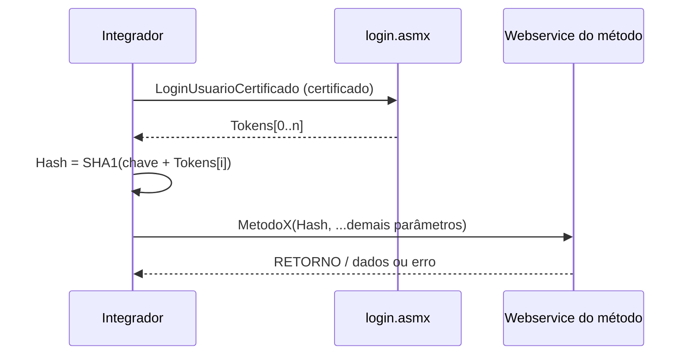

# Hash de autenticação — WSOficio

Documentação do mecanismo de segurança usado em **todas as operações SOAP**, exceto `LoginUsuarioCertificado` (que **fornece** os tokens).

Fonte: capítulo **2 — Requisitos de Segurança** em [`especificacao_wsoficio_dev.md`](../especificacao_wsoficio_dev.md).

---

## Visão geral

Cada requisição aos webservices ONR leva um parâmetro **`Hash`** no envelope de entrada. O servidor valida esse valor antes de executar a operação.

O hash **não é a chave** nem o token isolados: é o resultado de aplicar **SHA-1** sobre a **concatenação** `chave + token`, com texto em **UTF-8**, representado em **hexadecimal maiúsculo**.

```
Hash = SHA1_UTF8( chave + token ) → HEX_UPPERCASE
```

| Componente | Origem | Transmitido na SOAP? |
|------------|--------|----------------------|
| **Chave** | ONR entrega à serventia/instituição (e-mail: oficioeletronico@onr.org.br) | **Não** — fica só no integrador |
| **Token** | Retornado por `LoginUsuarioCertificado` | **Não** — só entra no cálculo do hash |
| **Hash** | Calculado pelo integrador | **Sim** — parâmetro `Hash` do método |

Restrição adicional: acesso aos serviços limitado por **IP** cadastrado no ONR.

---

## Fórmula

### Entrada

1. **Chave** — string secreta da serventia (ex.: UUID em `ONR_SERVENTIA_CHAVE` no `.env`).
2. **Token** — string dinâmica de **6 caracteres** (ex.: `JGX3QL`), obtida no login.

### Cálculo

```text
payload = chave + token          # concatenação, sem separador
Hash    = SHA1( payload UTF-8 )  # digest em hexadecimal MAIÚSCULO
```

### Exemplo (valores fictícios)

```text
chave  = 3BE1BF10-6792-4563-9ED7-9C2DA455F233
token  = JGX3QL
payload = 3BE1BF10-6792-4563-9ED7-9C2DA455F233JGX3QL
Hash    = SHA1(payload) → ex.: A1B2C3D4E5F6...  (40 caracteres hex)
```

### Implementação neste projeto

| Linguagem | Arquivo | Função |
|-----------|---------|--------|
| Python | [`lib/onr_hash.py`](../lib/onr_hash.py) | `compute_onr_auth_hash(chave, token)` |
| JavaScript | [`lib/onr_hash.js`](../lib/onr_hash.js) | `computeOnrAuthHash(chave, token)` |

```python
import hashlib

def compute_onr_auth_hash(chave: str, token: str) -> str:
    return hashlib.sha1(f"{chave}{token}".encode("utf-8")).hexdigest().upper()
```

---

## Obtenção do token (`LoginUsuarioCertificado`)

1. Autenticar com **certificado digital** (campos `SUBJECTCN`, `ISSUERO`, `PUBLICKEY`, `SERIALNUMBER`, `VALIDUNTIL`, `CPF`, `EMAIL`, `IDParceiroWS`).
2. Em resposta com `RETORNO = true`, usar o array **`Tokens`**.
3. Por padrão o login devolve **5 tokens** por chamada (quantidade configurável no ONR).

Regras dos tokens (especificação):

- Cada token só pode ser usado **uma vez** (um hash por token).
- Validade de **8 horas** após a geração.
- Formato: **6 caracteres** alfanuméricos.

Script de referência: [`scripts/login/login_onr.py`](../scripts/login/login_onr.py).

---

## Fluxo para chamar qualquer outro método



Passos práticos:

1. **Login** — obter lista de tokens.
2. **Escolher token** — índice `i` (no projeto: `ONR_HASH_TOKEN_INDEX`, padrão `0`).
3. **Calcular** — `Hash = compute_onr_auth_hash(ONR_SERVENTIA_CHAVE, token)`.
4. **Chamar o método** — incluir `Hash` no objeto de entrada (`oRequest` / parâmetros SOAP).
5. **Próxima chamada** — usar outro token ou fazer login de novo (token já usado → erro **46**).

Helpers no projeto: `resolve_auth_hash()` em [`lib/onr_acompanhamento.py`](../lib/onr_acompanhamento.py) (login automático + cálculo).

---

## Variáveis de ambiente (`.env`)

| Variável | Uso |
|----------|-----|
| `ONR_SERVENTIA_CHAVE` | Chave secreta da serventia (obrigatória para calcular o hash) |
| `ONR_HASH_TOKEN_INDEX` | Índice do token na lista retornada pelo login (padrão `0`) |
| `ONR_HASH_OVERRIDE` | Se definido, usa esse hash fixo (debug; ignora login/cálculo) |
| `ACOMPANHAMENTO_TITULOS_AUTO_LOGIN` | Quando `true`, scripts AT fazem login antes de cada chamada |

---

## Uso no envelope SOAP

Em todos os métodos documentados em [`metodos/`](metodos/) (exceto login), o primeiro parâmetro relevante de autenticação é:

| Parâmetro | Tipo (especificação) | Valor |
|-----------|----------------------|--------|
| `Hash` | `string(50)` | Resultado do cálculo acima |

A chave **nunca** deve ser enviada no XML da requisição.

---

## Erros relacionados ao hash

| Código | Descrição típica | Ação sugerida |
|--------|------------------|---------------|
| **11** | Hash não informado | Incluir `Hash` no request |
| **45** | Hash inválido | Conferir chave, token e fórmula SHA-1 UTF-8 |
| **46** | Hash já utilizado | Usar próximo token ou novo login |
| **47** | Hash expirado | Novo login (token com mais de 8 h) |

---

## Referências

- [`especificacao_wsoficio_dev.md`](../especificacao_wsoficio_dev.md) — § 2 e § 3.1
- [`metodos/LoginUsuarioCertificado.md`](metodos/LoginUsuarioCertificado.md) — origem dos tokens
- [`list-metodos.md`](list-metodos.md) — lista de operações que exigem `Hash`
